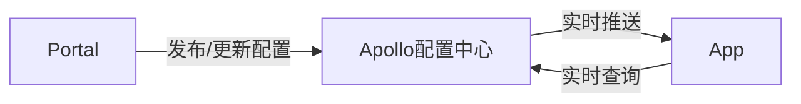
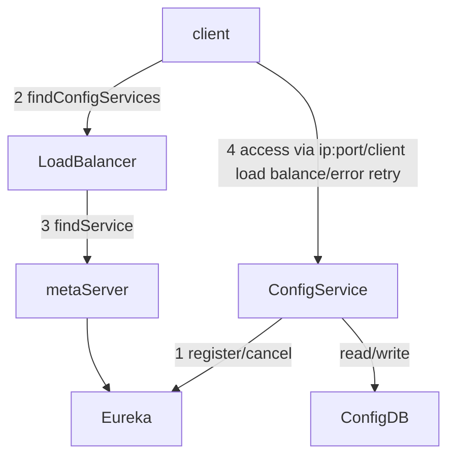
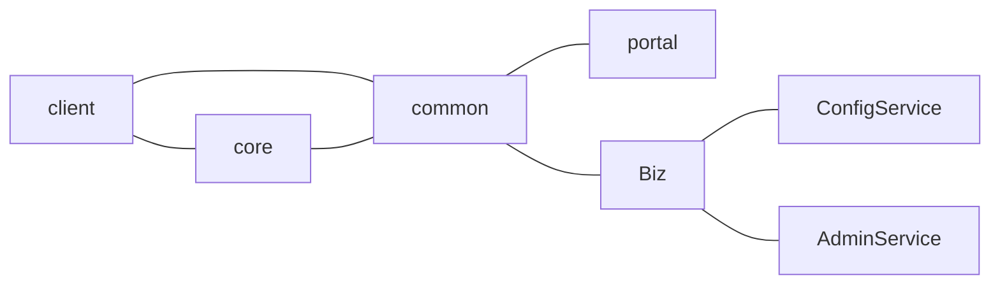
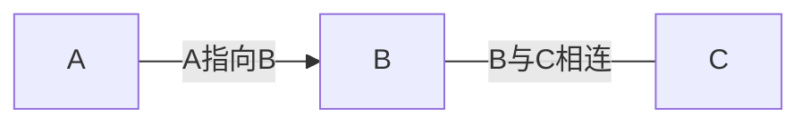

```mermaid

graph LR;
　　Portal-->|发布/更新配置|Apollo配置中心;
　　Apollo配置中心-->|实时推送|App;
　　App-->|实时查询|Apollo配置中心;

```


```mermaid

graph TB
　　client-->|2 findConfigServices|LoadBalancer;
　　LoadBalancer-->|3 findService|metaServer;
　　metaServer-->Eureka;
　　client-->|4 access via ip:port/client load balance/error retry|ConfigService;
　　ConfigService-->|1 register/cancel|Eureka;
　　ConfigService-->|read/write|ConfigDB;

```


```mermaid
graph LR;
　　client---core;
　　client---common;
　　core---common;
　　common---portal;
　　common---Biz;
　　Biz---ConfigService;
　　Biz---AdminService;
```
```
graph  TB（top--botom 上下排列）

graph BT  (botom--top)

graph  LR（left--right 左右排列）

graph  RL (right--left)

-->    在流程图中显示——>

---    在流程图中显示——
```


```mermaid
graph LR;
　　A-->|A指向B|B;
　　B---|B与C相连|C;
```

```mermaid
graph LR;
```

