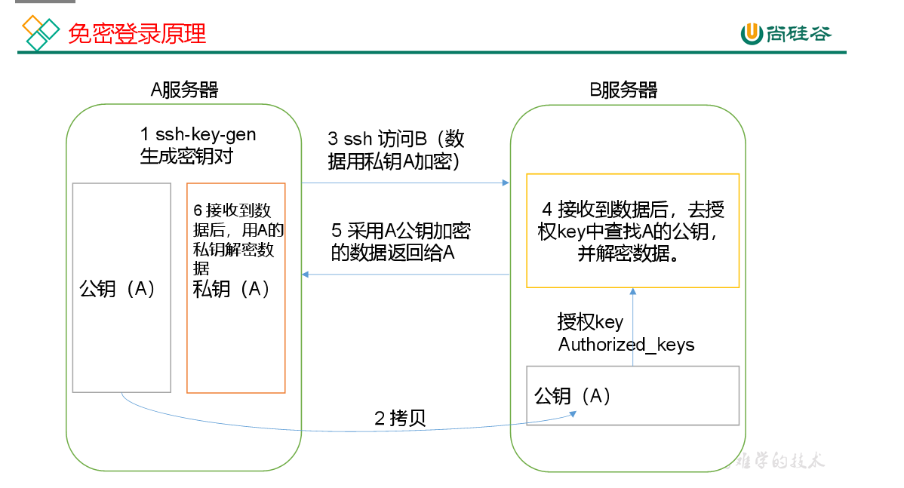

## sshd反应慢时

```
vi /etc/ssh/sshd_config
把
#UseDNS yes
修改为
UseDNS no
重启ssh服务
systemctl restart sshd
```

当我们频繁更换网络环境时，可能会发现sshd连接Linux虚拟机的速度变得很慢

为什么呢？

因为ssh的服务端在连接时会自动检测dns环境是否一致导致的


## ssh免密登录

**对称加密** 加密解密秘钥相同

**非对称加密** （rsa算法、ecdsa算法）加密解密密钥不一样




```sh
生成公钥和私钥 生成两个文件id_rsa（私钥）、id_rsa.pub（公钥）
ssh-keygen -t rsa
生成的秘钥保存在
/home/myhadoop/.ssh/id_rsa
将公钥拷贝到要免密登录的目标机器上
ssh-copy-id hadoop102
ssh-copy-id hadoop103
ssh-copy-id hadoop104

```

## .ssh文件夹

.ssh文件夹下 （~/.ssh） 的文件功能解释

| .ssh文件夹下的文件 |                                       |
| ------------------ | ------------------------------------- |
| authorized_keys    | 存放授权过的无密登录服务器公钥        |
| id_rsa.pub         | 生成的公钥                            |
| id_rsa             | 生成的私钥                            |
| known_hosts        | 记录ssh访问过计算机的公钥(public key) |

