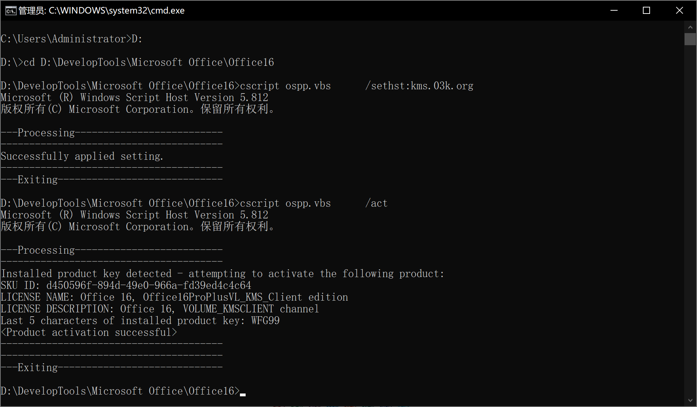

家庭版window没有hyper的解决办法

```shell
pushd "%~dp0"
dir /b %SystemRoot%\servicing\Packages\*Hyper-V*.mum >hyper-v.txt
for /f %%i in ('findstr /i . hyper-v.txt 2^>nul') do dism /online /norestart /add-package:"%SystemRoot%\servicing\Packages\%%i"
del hyper-v.txt
Dism /online /enable-feature /featurename:Microsoft-Hyper-V-All /LimitAccess /ALL
```

## 使用在线KMS激活Office系列

1. 已管理员身份运行cmd输入：`cd "C:\Program Files (x86)\Microsoft Office\Office16"` (cd 后面的路径替换成你的office安装路径）

2. 然后执行注册kms服务器地址，输入：cscript ospp.vbs  /sethst:kms.03k.org

3. 一般office不会马上连接kms服务器进行激活，所以我们额外补充一条手动激活命令：cscript ospp.vbs    /act 成功如图所示

   