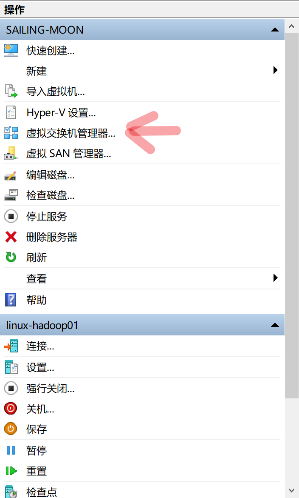
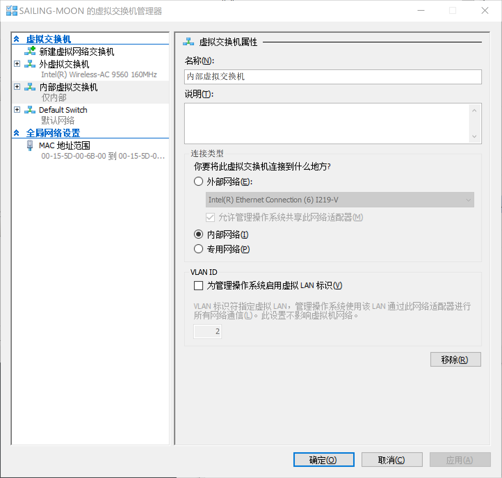
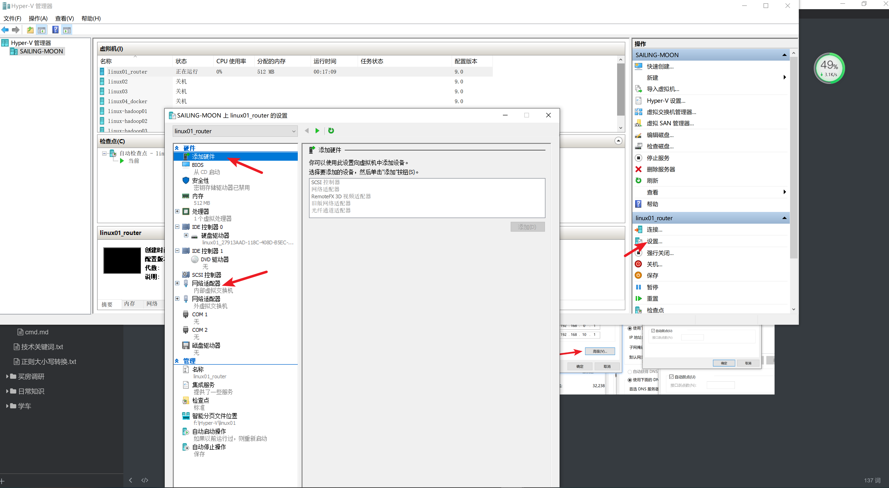
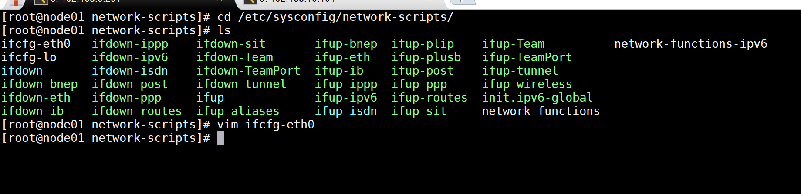
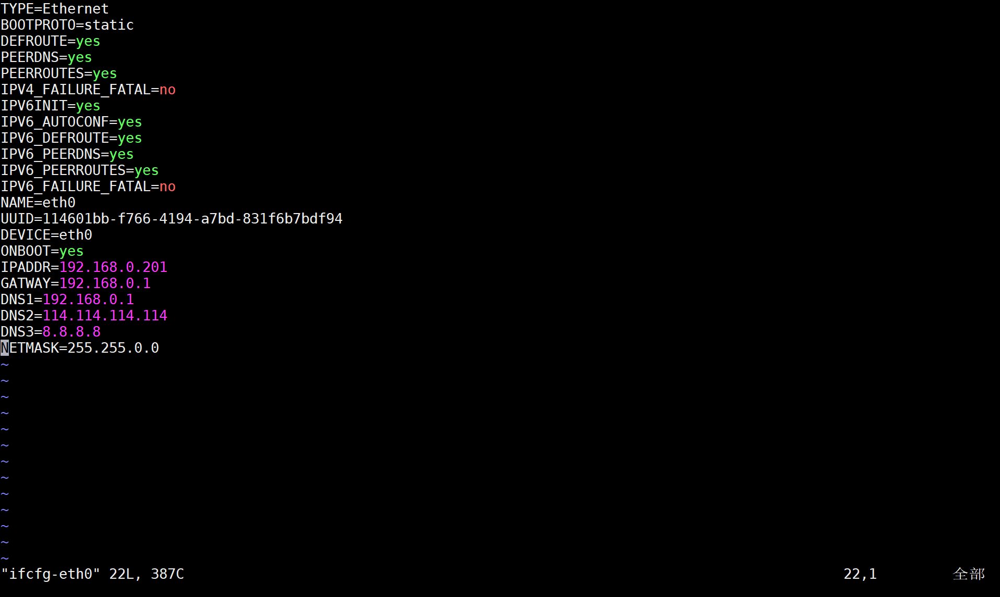

# 不同网段虚拟机互相访问操作总结

基于hyper-v管理器操作

## 第一步 虚拟交换机的配置

配置一个虚拟交换器






**操作完上面的步骤可以保证物理机能够访问到192.168.0.x和192.168.10.x这两个网段的地址**

## 第二步 虚拟机的配置







```properties
TYPE=Ethernet
BOOTPROTO=static
DEFROUTE=yes
PEERDNS=yes
PEERROUTES=yes
IPV4_FAILURE_FATAL=no
IPV6INIT=yes
IPV6_AUTOCONF=yes
IPV6_DEFROUTE=yes
IPV6_PEERDNS=yes
IPV6_PEERROUTES=yes
IPV6_FAILURE_FATAL=no
NAME=eth0
# uuid生成
UUID=114601bb-f766-4194-a7bd-831f6b7bdf94
DEVICE=eth0
ONBOOT=yes
IPADDR=192.168.0.201
GATWAY=192.168.0.1
DNS1=192.168.0.1
DNS2=114.114.114.114
DNS3=8.8.8.8
NETMASK=255.255.0.0
```

将虚拟机的子网掩码设置为255.255.0.0即可让该虚拟机访问到其他网段的地址