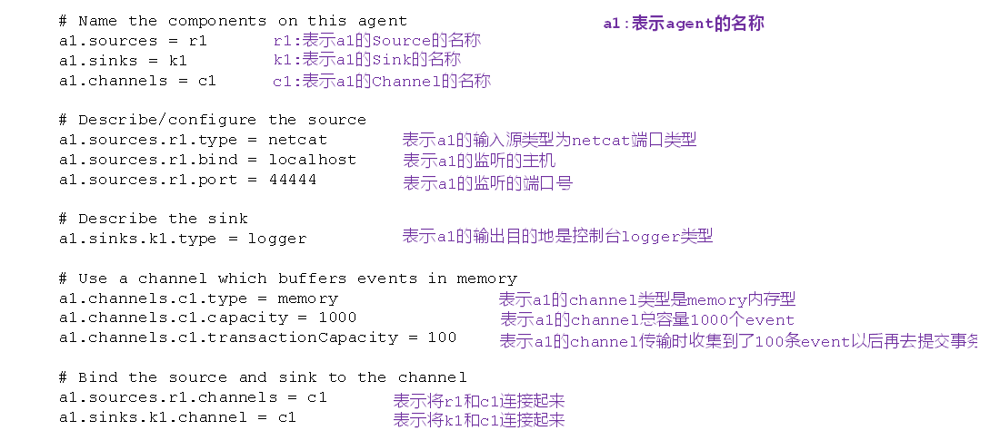

# Flume

## 概念

## 部署

### 安装nc （netcat）

```bash
sudo yum install -y nc
#nc监听某个端口
nc -l 12345
# 发送某个数据给端口
nc localhost 44444
#然后输入文本，回车

```

### 安装flume

```bash
tar -zxf /opt/software/apache-flume-1.9.0-bin.tar.gz -C /opt/module/
mv /opt/module/apache-flume-1.9.0-bin /opt/module/flume
# 将lib文件夹下的guava-11.0.2.jar删除以兼容Hadoop 3.1.3
rm /opt/module/flume/lib/guava-11.0.2.jar
mkdir /opt/module/flume/job
vim /opt/module/flume/job/flume-netcat-logger.conf


```

```sh
# 添加
# Name the components on this agent
a1.sources = r1
a1.sinks = k1
a1.channels = c1

# Describe/configure the source
a1.sources.r1.type = netcat
a1.sources.r1.bind = localhost
a1.sources.r1.port = 44444

# Describe the sink
a1.sinks.k1.type = logger

# Use a channel which buffers events in memory
a1.channels.c1.type = memory
a1.channels.c1.capacity = 1000
a1.channels.c1.transactionCapacity = 100

# Bind the source and sink to the channel
a1.sources.r1.channels = c1
a1.sinks.k1.channel = c1
```



开启监听端口

```sh
#第一种写法:
flume-ng agent --name agent的名字 --conf 配置文件的目录 --conf-file agent的配置文件（自己手动写） -Dflume.root.logger=INFO,console
# 示例
bin/flume-ng agent --conf conf/ --name a1 --conf-file job/flume-netcat-logger.conf -Dflume.root.logger=INFO,console
#第二种写法
flume-ng agent -n agent的名字 -c 配置文件的目录 -f agent的配置文件（自己手动写） -Dflume.root.logger=INFO,console
# 示例
bin/flume-ng agent -c conf/ -n a1 -f job/flume-netcat-logger.conf -Dflume.root.logger=INFO,console
```

​	--conf/-c：表示配置文件存储在conf/目录

​    --name/-n：表示给agent起名为a1

​    --conf-file/-f：flume本次启动读取的配置文件是在job文件夹下的flume-telnet.conf文件

​	-Dflume.root.logger=INFO,console ：-D表示flume运行时动态修改flume.root.logger参数属性值，并将控制台日志打印级别设置为INFO级别。日志级别包括:log、info、warn、error