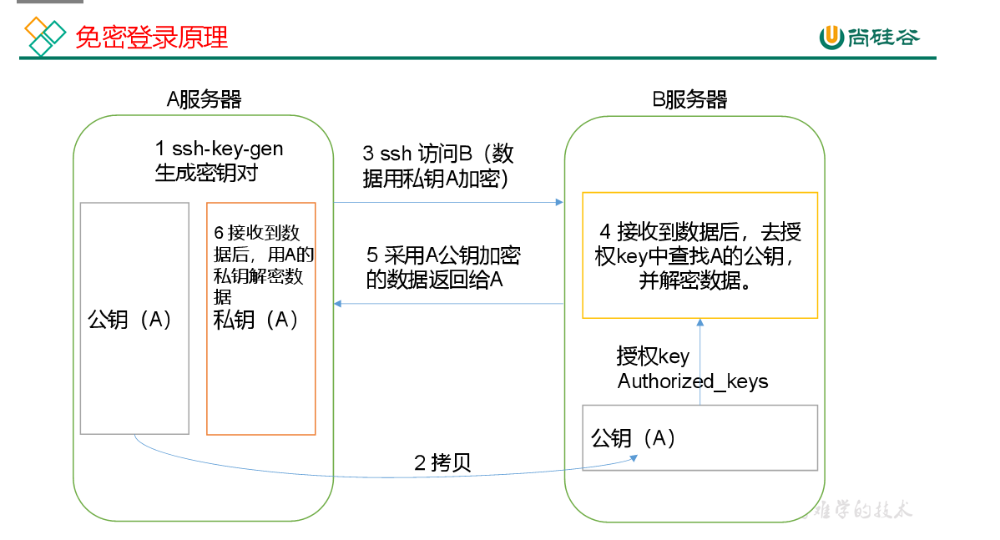
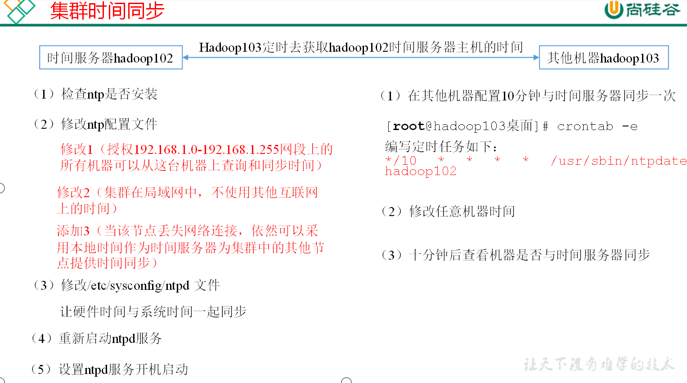

# 集群搭建


## hadoop 运行模式

​		hadoop运行模式包括：本地模式、伪分布模式以及完全分布模式

### 本地运行模式

```sh
# 1 hadoop-3.1.3下面创建一个wcinput文件夹
mkdir wcinput
# 2 wcinput文件夹下创建一个wc.input文件
cd wcinput
vi wc.input
# 3 添加以下内容
hadoop yarn
hadoop mapreduce
myhadoop
myhadoop
# 执行程序
hadoop jar /opt/module/hadoop-3.1.3/share/hadoop/mapreduce/hadoop-mapreduce-examples-3.1.3.jar wordcount wcinput wcoutput
# 查看结果
cd /opt/module/hadoop-3.1.3
cat wcoutput/part-r-00000
```

### 完全分布模式

#### 基本准备

```sh
1）准备3台客户机（关闭防火墙、静态ip、主机名称）
2）安装JDK
3）配置环境变量
4）安装Hadoop
5）配置环境变量
6）配置集群
7）单点启动
8）配置ssh
9）群起并测试集群
```

#### 编写集群分发脚本xsync

##### 了解scp

```sh
# scp命令可以实现服务器与服务器之间数据拷贝
# scp -r $pdir/$fname $user@hadoopx$host:$pdir/$fname
# 命令 递归 要拷贝的文件路径/名称 目的用户@主机:目的路径/名称
# 实操案例
# 在hadoop101上，将hadoop101中/opt/module和/etc/profile目录下的文件拷贝到hadoop102上。
scp -r /opt/module root@hadoop102:/opt/module
sudo chown myhadoop:myhadoop -R /opt/module
scp /etc/profile root@hadoop102:/etc/profile
sudo source /etc/profile
```

##### rsync远程同步工具

rsync只要勇于备份和镜像。具有速度快、避免复制相同的内容和支持符号链接的有点。它比scp复制速度快，只对差异文件做更新。scp会把所有文件都复制过去。

```sh
rsync -av $pdir/$fname $user@hadoopx$host:$pdir/$fname
# 命令 选项参数 要拷贝的文件路径/名称 目的用户@主机:目的路径/名称
-a 归档拷贝
-v 显示复制过程
```

##### xsync集群分发脚本

> 在/home/myhadoop/bin这个目录下存放的脚本，myhadoop用户可以在系统任何地方直接执行

脚本编辑

1. 创建/home/myhadoop/bin

```sh

mkdir /home/myhadoop/bin
cd /home/myhadoop/bin
vim xsync

```

2. 添加以下内容

```sh
#!/bin/bash
# 判断参数个数
if [ $# -lt 1 ]
then
	echo not enough arguement!
	exit;
fi
# 遍历所有集群机器
for host in hadoop101 hadoop102 hadoop103
do
	echo ========== $host ==========
	# 遍历所有目录挨个发送
	for file in $@
	do
		# 判断文件是否存在
		if [ -e $file ]
		then
			# 获取父目录
			pdir=$(cd -P $(dirname $file); pwd)
			# 获取当前文件名称
			fname=$(basename $file)
			ssh $host "mkdir -p $pdir"
			rsync -av $pdir/$fname $host:$pdir
		else
			echo $file does not exits!
		fi
	done
done
```

3. 修改权限

   ```sh
   chmod +x xsync
   # 测试
   sudo xsync /home/myhadoop/bin
   ```

##### 设置SSH免密登录



```sh
# 生成公钥私钥
ssh-keygen -t rsa
# 拷贝公钥私钥到其他机器
ssh-copy-id hadoop101
ssh-copy-id hadoop102
ssh-copy-id hadoop103

```

详细整理参考 ssh[免密登录](../../Linux/sshd反应慢.md)

## 集群配置

注意：nameNode和secondaryNameNode不要安装在同一台服务器；ResourceManager也很消耗内存，不要和NameNode、SecondaryNameNode配置在同一台机器

### 集群角色

| hadoop101 | hadoop102 | hadoop104 |      |
| --------- | --------- | --------- | ---- |
| NN        | DN        | 2NN       | HDFS |
| DN        | RM        | DN        |      |
| NM        | NM        | NM        | YARN |

[核心配置文件配置详情](hadoop集群配置-核心配置文件配置详情.md)

### 分发配置

```
xsync /opt/module/hadoop-3.1.3/etc/hadoop/
# 查看
cat /opt/module/hadoop-3.1.3/etc/hadoop/core-site.xml
```

### 群起集群

#### 配置worker

```sh
vim /opt/module/hadoop-3.1.3/etc/hadoop/workers
# 增加以下内容
hadoop101
hadoop102
hadoop103
# 同步所有节点配置
xsync /opt/module/hadoop-3.1.3/etc

```


#### 启动集群

1. ***如果集群是第一次启动***，需要在hadoop101节点格式化NameNode（注意格式化之前，一定要先停止上次启动的所有namenode和datanode进程，然后再删除data和log数据）;

   ````
   sbin/stop-dfs.sh
   rm -rf data/ logs/
   hdfs namenode -format
   ````

2. 启动HDFS  `sbin/start-dfs.sh`

3. ***在配置了ResourceManager的节点（******hadoop102***）***启动YARN  `sbin/start-yarn.sh`

4. Web端查看SecondaryNameNode;浏览器中输入：http://hadoop102:9868/status.html;查看SecondaryNameNode信息;

#### 集群基本测试

```sh
# 上传小文件
hadoop fs -mkdir -p /user/myhadoop/input
hadoop fs -put $HADOOP_HOME/wcinput/wc.input /user/myhadoop/input
# 上传大文件
hadoop fs -put  /opt/software/hadoop-3.1.3.tar.gz  /
# 查看HDFS文件存储路径
pwd
# 查看HDFS在磁盘存储文件内容
cat blk_1073741825
# 拼接
cat blk_1073741836>>tmp.jar
cat blk_1073741837>>tmp.jar
tar -zxvf tmp.jar
# 下载
bin/hadoop fs -get
 /hadoop-3.1.3.tar.gz ./
# 执行wordcount程序
hadoop jar share/hadoop/mapreduce/hadoop-mapreduce-examples-3.1.3.jar wordcount /user/myhadoop/input /user/myhadoop/output
```

#### 集群启动/停止方式

##### 1）逐一停止

1. 分别启动/停止HDFS组件

   `hdfs --daemon start/stop namenode/datanode/secondarynamenode`

2. 启动/停止YARN

   `yarn --daemon start/stop resourcemanager/nodemanager`

   

##### 2）各个模块分开启停（配置ssh的前提）

1. 整体启动/停止HDFS

   `start-dfs.sh/stop-dfs.sh`

2. 整体启动/停止YARN

   `start-yarn.sh/stop-yarn.sh`

   

### 配置历史服务器

为了查看程序的历史运行情况，需要配置一下历史服务器。

##### 配置mapred-site.xml

`vi mapred-site.xml`

```xml
<!-- 历史服务器端地址 -->
<property>
    <name>mapreduce.jobhistory.address</name>
    <value>hadoop101:10020</value>
</property>

<!-- 历史服务器web端地址 -->
<property>
    <name>mapreduce.jobhistory.webapp.address</name>
    <value>hadoop101:19888</value>
</property>
```

##### 分发配置

`xsync $HADOOP_HOME/etc/hadoop/mapred-site.xml`

##### 在hadoop101启动历史服务器

`mapred --daemon start historyserver`

##### 查看历史服务器是否启动

`jps`

##### 查看JobHistory

`http://hadoop101:19888/jobhistory`

### 配置日志的聚集

日志聚集概念：应用运行完成以后，将程序运行日志信息上传到HDFS系统上。

日志聚集功能好处：可以方便的查看到程序运行详情，方便开发调试。

注意：开启日志聚集功能，需要重新启动NodeManager 、ResourceManager和HistoryManager。

[参考日志聚集功能配置](hadoop集群配置-日志聚集功能的配置.md)

### 集群时间同步

时间同步的方式：找一个机器，作为时间服务器，所有的机器与这台集群时间进行定时的同步，比如，每隔十分钟，同步一次时间



#### 时间服务器配置（必须root用户）

```sh
#在所有节点关闭ntp服务和自启动
sudo systemctl stop ntpd
sudo systemctl disable ntpd
#修改ntp配置文件
vim /etc/ntp.conf
    # 授权192.168.10.0-192.168.10.255网段上的所有机器可以从这台机器上查询和同步时间
    restrict 192.168.10.0 mask 255.255.255.0 nomodify notrap
    # 集群在局域网中，不使用其他互联网上的时间
    #server 0.centos.pool.ntp.org iburst
    #server 1.centos.pool.ntp.org iburst
    #server 2.centos.pool.ntp.org iburst
    #server 3.centos.pool.ntp.org iburst
    #当该节点丢失网络连接，依然可以采用本地时间作为时间服务器为集群中的其他节点提供时间同步
    server 127.127.1.0
    fudge 127.127.1.0 stratum 10
# 修改/etc/sysconfig/ntpd 文件
vim /etc/sysconfig/ntpd
	#让硬件时间与系统时间一起同步
	SYNC_HWCLOCK=yes
# 重新启动ntpd服务
systemctl start ntpd
# 设置ntpd服务开机启动
systemctl enable ntpd

```

#### 其他机器配置（必须root用户）

```
# 在其他机器配置10分钟与时间服务器同步一次
crontab -e
	*/10 * * * * /usr/sbin/ntpdate hadoop101
# 测试 主动修改时间
date -s "2017-9-11 11:11:11"
# 十分钟后查看机器是否与时间服务器同步
date
```


查看邮件cat $MAIL

