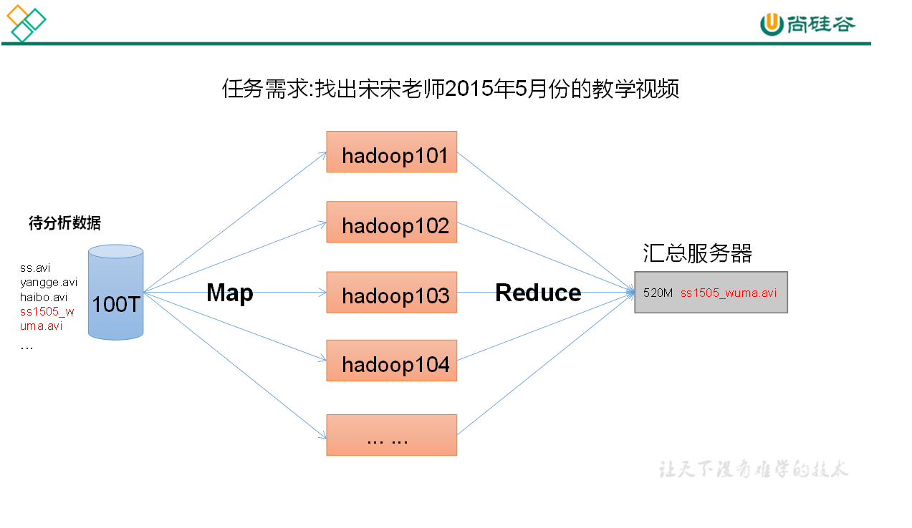
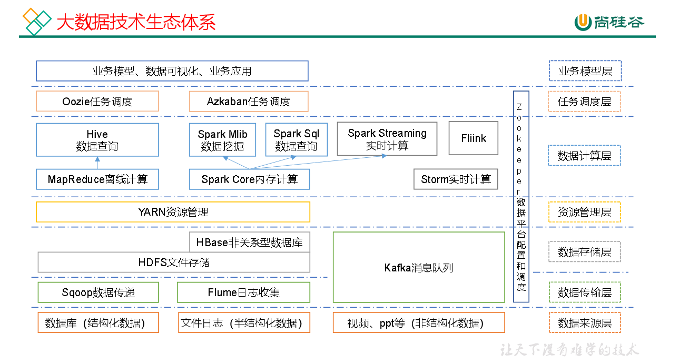
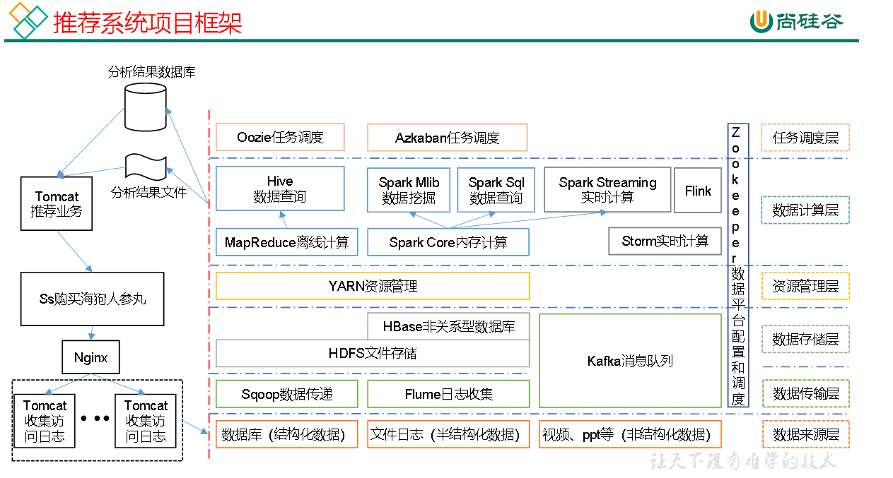

# hadoop优势
```txt
高可靠性：
hadoop底层维护了多个数据副本，所以即使hadoop某个计算元素存储出现故障，也不会导致数据丢失
高扩展性：
在集群数据间分配任务数据，可方便扩展数以千计的节点
高效性：
mapreduce的思想下，hadoop并行工作的，以加快任务处理速度。
高容错性：
能够将自动失败的任务重新分配
```

# hadoop组成
hadoop 1.x 组成
```
MapReduce(计算+资源调度)*
HDFS（数据存储）*
Common（辅助工具）
```
Hadoop 2.x
```
Mapreduce(计算)
Yarn（资源调度）
HDFS（数据存储）
Common（辅助工具）
```
1.x 和 2.x 区别就是资源调度的功能中mapreduce拆分出来了


## **HDFS 架构**
**hadoop distributed file sysytem --hadoop**分布式文件系统

1.**NameNode(nn)**
  存储文件的元数据，如文件名，文件目录结构，文件属性（生成时间，副本数，文件权限），以及每个文件的块列表DataNode

  整个集群中只有一份，读和写都需要访问nn，相当于目录
2.**datanode(dn)**
  在本地文件系统存储文件块数据，以及块数据的校验和

  负责存具体的文件
3.**Secondary NameNode(2nn)**
  每间隔一段时间对nn元数据备份

  2nn不是nn的热备份，是nn的助手

nn下
-->有多个dn
-->2nn备份nn数据

## **Yarn 架构**

计算机资源调度，给任务分配cpu和内存

1.resourceManager（RM）
  处理客户端请求、监控nodemanager，启动或监控applicationMaster、资源分配和调度
2.NodeManager(NM)
  管理单个节点上的资源、处理来自resourceManager的命令、处理来自ApplicationMaster的命令

3.ApplicationMaster(AM)
  负责数据切分、为应用程序申请资源并分配给内部任务、任务监控和容错

4.Container
  它是yarn中的资源抽象，它分装了某个节点上的多维度资源，如内存，cpu，磁盘，网络等


```
[client]--                                            ---[NodeManager] + [Container] + [applicationMaster]
          --job submission--->[ResourceManager] <---node status + resource request--- 
[client]--                                            ---[NodeManager] + [Container] + [applicationMaster]
[client]--                                            ---[NodeManager] + [Container] + [applicationMaster]

```

## **Map Reduce**
MapReduce将计算过程分为两个阶段，Map+Reduce

Map阶段并行处理出入数据

Reduce阶段对Map的结果进行汇




## 大数据技术生态



1. sqoop 是一款开源的工具，主要用在Hadoop，Hive与传统的数据库（mysql）间进行数据的传递。它可以将一个关系型数据库中的数据导进到Hadoop的Hdfs在，也可以将Hdfs的数据导出到关系型数据库；
2. Flume是一个高可用、高可靠、分布式的海量日志采集、聚合和传输的系统；它支持在日志系统中定制各类数据发送方，用于收集数据；
3. Kafka 是一种高吞吐量的分布式发布订阅消息系统；
4. Strom用于“连续计算”，对数据流做连续查询，在计算时就将结果以流的形式输出给用户；
5. Spark是当前最流行的开源大数据内存计算框架；可以基于hadoop上存储的大数据进行计算；
6. Flink是当前最流行的开源大数据内存计算框架；用于实时计算的场景较多；
7. Oozie是一个管理Hadoop作业的工作流调度管理系统；
8. Hbase是一个分布式、面向列的开源数据库。Hbase不同于一般的关系型数据库，他是一个适合于非结构化数据存储的数据库；
9. Hive是基于Hadoop的一个数据仓库工具，可以将结构化的数据文件映射为一张数据库表，并提供简单的sql查询功能，可以将sql语句转换为MapReduce任务进行运行。优点是学习成本底，可以通过类sql语句快速实现简单的MapReduce统计不必开发MapReduce应用；
10. ZooKeeper是一个针对大型分布式系统的可靠协调系统，提供的功能包括：配置维护、名字服务、分布式同步、组服务。


### 推荐系统框架




