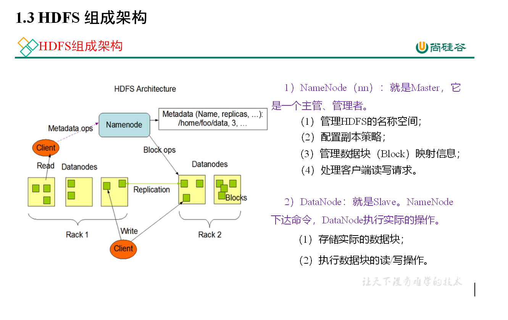
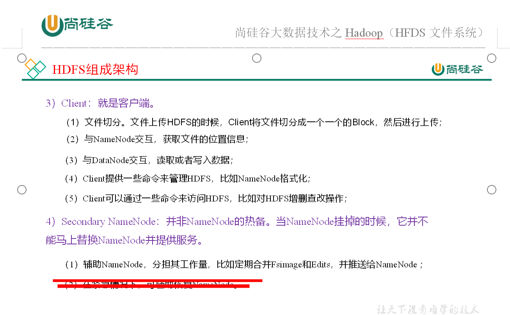
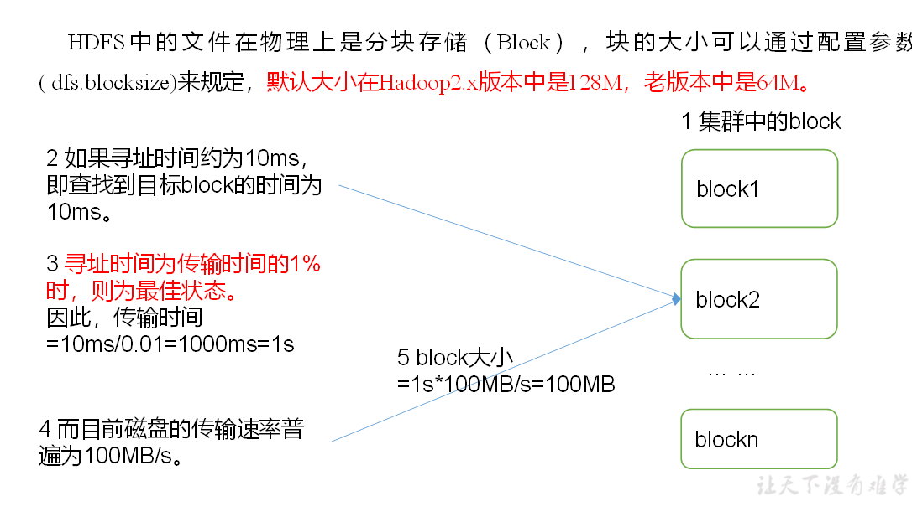
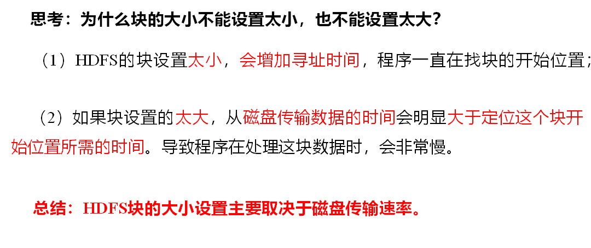

# HDFS概述

## 背景和定义

### 背景

数据量的与日俱增，一个操作系统存不下所有的数据，那么就分配到了更多系统管理的磁盘中，方便管理和维护，迫切需要一种系统来管理多台机器上的文件，这就是分布式文件管理系统。hdfs是一种分布式文件管理系统。

### 定义

hadoop distributed file system

hdfs是一个文件系统，用于存储文件，通过目录树来定位文件，它是分布式的，由很多服务器联合起来实现其功能，集群中的服务器有各自的角色。

hdfs应用场景，适合一次写入，多次读书的场景，且不支持文件的修改。适合用来做数据分析不适合做网盘应用。

## 优缺点

### 优点

1. 高容错性 数据自动保存多个副本。它通过增加副本的形式，提高容错性；某一个副本丢失会自动恢复。

2. 适合处理大数据 数据规模：能够处理数据规模达到TB，甚至更多；文件规模，百万规模的文件数量处理；

3. 可构建在廉价机器上，通过多福吧机制提高可靠性

### 缺点

1. 不适合低延迟的数据访问，比如毫秒级的存储数据

2. 无法高效对大量小文件进行存储

   存储大量小文件，会占用 大量内存来存储文件目录和快信息。

   小文件存储导致寻址时间超过读取时间，这样违反hdfs的设计原则

3. 不支持并发写入，文件随机修改

   一个文件只能一个写，不允许多线程写

   仅支持数据append 追加，不支持文件随机修改

## hdfs组成架构

##  HDFS文件块大小（面试重点）

