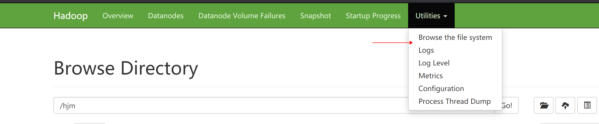

# HDFS的Shell操作

hadoop fs + 基本命令

hdfs dfs + 基本命令

上面两个完全等价

```sh
hadoop fs -ls 目录
```


## 本地 -> Hdfs

```sh
# put 将文件上传到hdfs
hdfs dfs -put 文件
# copyFromLocal 和 put很类似 不过这个命令是多线程的
hdfs dfs -copyFromLocal 文件
# moveFromLocal 上传之后文件就没了 类似剪切功能
hdfs dfs -copyFromLocal 文件
# appendToFile 将文件追加到其他文件之后
hdfs dfs -appendToFile 文件 /hdfs文件
# 不用本地文件 通过输入的形式最近
hdfs dfs -appendToFile - /hdfs文件
# 到NN上去查看文件目录信息
http://hadoop101:9870/explorer.html
```



## Hdfs -> Hdfs

```sh
hdfs dfs
-cp 复制
-mv 移动
-chown 变更归属
-chgrp 变更组
-chmod 变更权限
-mkdir 创建目录
-du 统计文件大小信息
-df 磁盘使用情况统计
-ls 显示目录信息
-cat 显示文件内容
-tail 显示文件末尾
-rm 移除一个文件/夹
-rmdir 移除空目录
-setrep 设置文件副本数量

```

## HDFS -> 本地

```sh
# get 下载文件到本地
hdfs dfs -get /hjm/README.txt /tmp
# getmerge 合并下载
 hdfs dfs -getmerge /hjm/*.txt /tmp/1.txt
# copyToLocal  同get 一样
```

