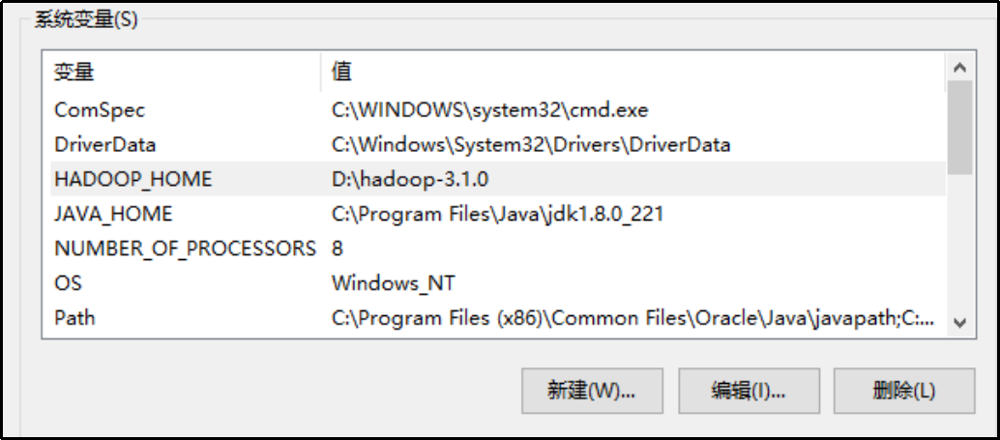
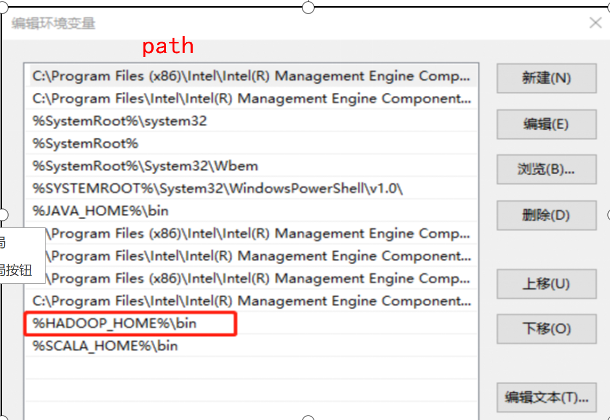
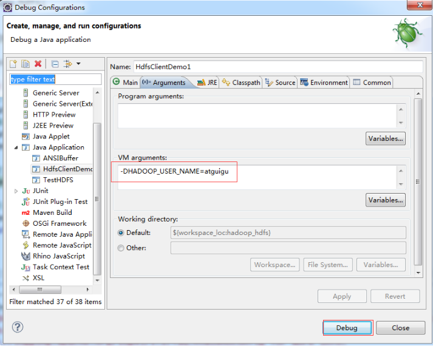

# HDFS客户端操作

## 环境准备

1. 准备hadoop客户端在windows的依赖文件保存在

   `D:\DevEnvironment\hadoop-3.0.0`

2.  配置HADOOP_HOME环境变量





4. 创建一个maven新项目HdfsClientDemo,添加依赖和log4j2.xml文件

   ```xml
   <dependencies>
       <dependency>
           <groupId>junit</groupId>
           <artifactId>junit</artifactId>
           <version>4.12</version>
       </dependency>
       <dependency>
           <groupId>org.apache.logging.log4j</groupId>
           <artifactId>log4j-slf4j-impl</artifactId>
           <version>2.12.0</version>
       </dependency>
       <dependency>
           <groupId>org.apache.hadoop</groupId>
           <artifactId>hadoop-client</artifactId>
           <version>3.1.3</version>
       </dependency>
   </dependencies>
   ```

   ```xml
   <?xml version="1.0" encoding="UTF-8"?>
   <Configuration status="error" strict="true" name="XMLConfig">
       <Appenders>
           <!-- 类型名为Console，名称为必须属性 -->
           <Appender type="Console" name="STDOUT">
               <!-- 布局为PatternLayout的方式，
               输出样式为[INFO] [2018-01-22 17:34:01][org.test.Console]I'm here -->
               <Layout type="PatternLayout"
                       pattern="[%p] [%d{yyyy-MM-dd HH:mm:ss}][%c{10}]%m%n" />
           </Appender>
            </Appenders>
       <Loggers>
           <!-- 可加性为false -->
           <Logger name="test" level="info" additivity="false">
               <AppenderRef ref="STDOUT" />
           </Logger>
   
           <!-- root loggerConfig设置 -->
           <Root level="info">
               <AppenderRef ref="STDOUT" />
           </Root>
       </Loggers>
   </Configuration>
   ```

   

5. 创建HdfsClient

   ```java
   public class HdfsClient{	
   @Test
   public void testMkdirs() throws IOException, InterruptedException, URISyntaxException{
   		
   		// 1 获取文件系统
   		Configuration configuration = new Configuration();
   		// 配置在集群上运行
   		// configuration.set("fs.defaultFS", "hdfs://hadoop101:8020");
   		// FileSystem fs = FileSystem.get(configuration);
   
   		FileSystem fs = FileSystem.get(new URI("hdfs://hadoop101:8020"), configuration, "myhadoop");
   		
   		// 2 创建目录
   		fs.mkdirs(new Path("/1108/daxian/banzhang"));
   		
   		// 3 关闭资源
   		fs.close();
   	}
   }
   ```

   

**注意： 客户端去操作HDFS时，是有一个用户身份的。默认情况下，HDFS客户端API会从JVM中获取一个参数来作为自己的用户身份：-DHADOOP_USER_NAME=myhadoop，myhadoop为用户名称**



## 其他hdfs操作验证

FileSystem类提供了对应的hdfs操作api，客户端可以自定义参数操作hdfs；

参数优先级排序：（1）客户端代码中设置的值 >（2）ClassPath下的用户自定义配置文件 >（3）然后是服务器的默认配置

