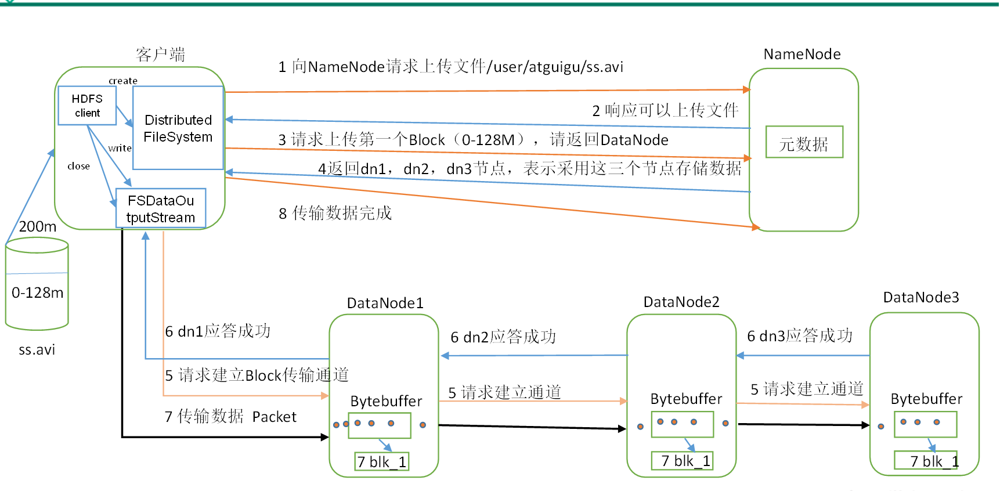
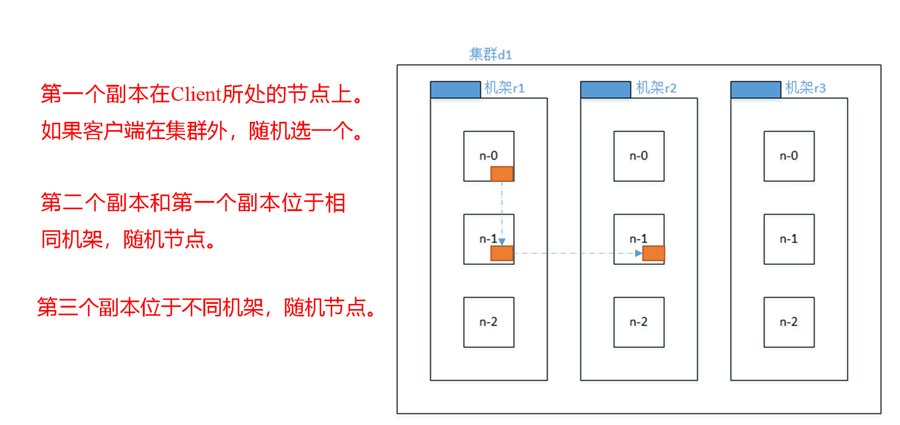
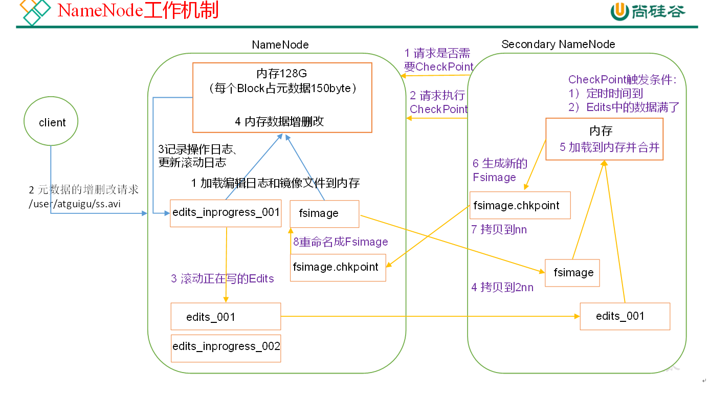
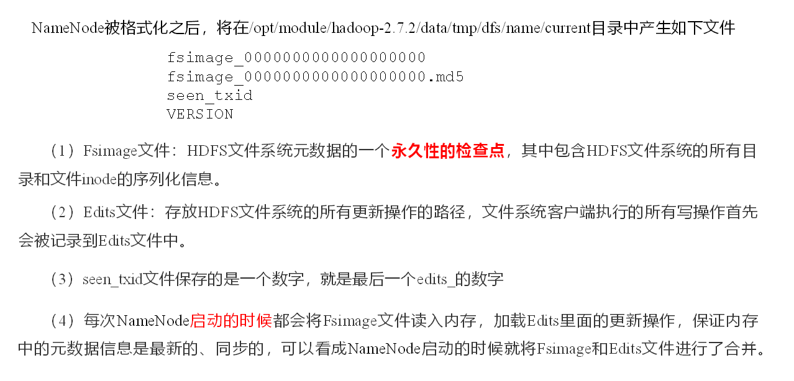
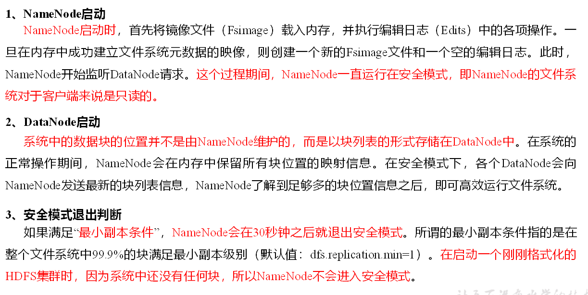
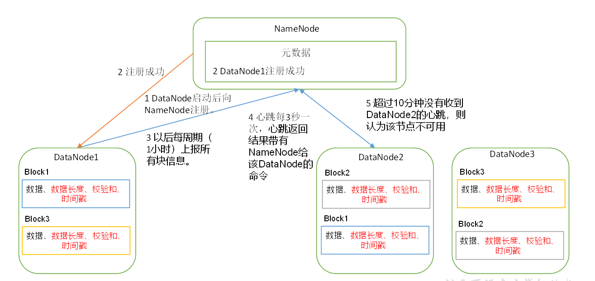
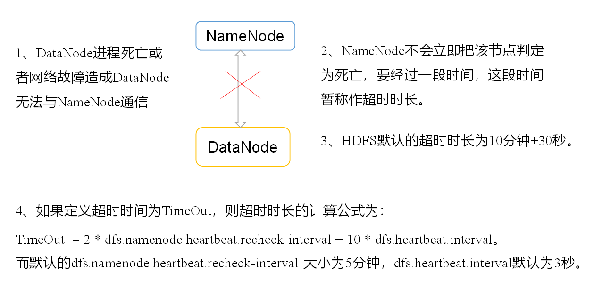

# HDFS数据流

## HDFS写数据流程



如图NN向客户端返回数据存储的节点列表，客户端请求连接一个节点，各个节点再逐级连接创建好数据流通道；一个数据块完成之后，下一个数据块会从第三步开始再次传输。

如果传输过程中节点之间的连接挂了，会报异常，但不会影响到整个上传流程，因为第一个节点获取到完整数据之后，集群会启动副本恢复机制；如果是客户端和节点连接挂了，则上传不成功。

## 网络拓扑-节点距离计算


​	在HDFS写数据的过程中，NameNode会选择距离待上传数据最近距离的DataNode接收数据；节点距离：两个节点到达最近的共同祖先的距离总和。


## Hadoop的机架感知

[官网的说明](http://hadoop.apache.org/docs/r3.1.3/hadoop-project-dist/hadoop-hdfs/HdfsDesign.html#Data_Replication)

> For the common case, when the replication factor is three, HDFS’s placement policy is to put one replica on the local machine if the writer is on a datanode, otherwise on a random datanode, another replica on a node in a different (remote) rack, and the last on a different node in the same remote rack

## 副本节点选择



## HDFS读流程


（1）客户端通过Distributed FileSystem向NameNode请求下载文件，NameNode通过查询元数据，找到文件块所在的DataNode地址。

（2）挑选一台DataNode（就近原则，然后随机）服务器，请求读取数据。

（3）DataNode开始传输数据给客户端（从磁盘里面读取数据输入流，以Packet为单位来做校验）。

（4）客户端以Packet为单位接收，先在本地缓存，然后写入目标文件。

## NameNode和SecondaryNameNode

### 1.NN和2NN的工作机制

#### 思考：NN中的元数据存储在哪里？

**元数据的信息存放在NN的内存中，为了防止断电等不可抗力因素导致数据丢失，NN在磁盘中将内存中的元数据持久化成FsImage文件**。这样就产生内新的问题，内存中元数据更新的时候同时更新FsImage会导致效率过低，如果不更新就会导致一致性问题；一旦NN断电就会产生数据丢失。

因此，引入Edits文件（只追加文件信息，效率很高）。每当元数据有更新或者增加的时候，将修改内存元数据的信息操作追加到Edits文件中。这样NN断电修复之后，集群可以通过FsImage和Edits文件进行数据修复。

长时间追加Edits文件，会导致文件数据量过大，效率依旧会被影响，导致断电之后修复时间过长；因而，需要定时尽心FsImage和Edits文件合并。为了减少NN的压力这样的操作有2NN来完成。

#### NN和2NN工作机制



##### 第一阶段 NN启动

第一次NN启动，格式化之后创建FsImage和Edits。不是第一次启动则会加载FsImage和Edits生成元数据；

客户端期间对元数据有操作，NN修改内存中的元数据，同时NN利用Edits记录操作，滚动更新。

##### 第二价段 2NN定时问询

2NN会定时向NN询问是否需要CheckPoint，NN返回检查结果；

2NN收到肯定的回答之后，向NN请求执行CheckPoint操作；

NN会将CheckPoint前的Edits和FsImage文件拷贝到2NN文件；

2NN文件加载该两个文件进行合并操作，并生成新的镜像文件FsImage.chkpoint；

2NN将文件拷贝到NN

NN将文件重命名为fsImage

#### FsImage和Edits



#### oiv和oev命令

```sh
# oiv            apply the offline fsimage viewer to an fsimage
# oev            apply the offline edits viewer to an edits file
# 基本语法
hdfs oiv -p 文件类型 -i 镜像文件 -o 转换后文件输出路径
hdfs oev -p 文件类型 -i编辑日志 -o 转换后文件输出路径
# oiv操作
hdfs oiv -p XML -i fsimage_0000000000000000025 -o /opt/module/hadoop-3.1.3/fsimage.xml
cat /opt/module/hadoop-3.1.3/fsimage.xml
# oev
hdfs oev -p XML -i edits_0000000000000000012-0000000000000000013 -o /opt/module/hadoop-3.1.3/edits.xml
cat /opt/module/hadoop-3.1.3/edits.xml
```

fsimage.xml部分内容如下

```xml

<inode>
	<id>16386</id>
	<type>DIRECTORY</type>
	<name>user</name>
	<mtime>1512722284477</mtime>
	<permission>myhadoop:supergroup:rwxr-xr-x</permission>
	<nsquota>-1</nsquota>
	<dsquota>-1</dsquota>
</inode>
<inode>
	<id>16387</id>
	<type>DIRECTORY</type>
	<name>myhadoop</name>
	<mtime>1512790549080</mtime>
	<permission>myhadoop:supergroup:rwxr-xr-x</permission>
	<nsquota>-1</nsquota>
	<dsquota>-1</dsquota>
</inode>
<inode>
	<id>16389</id>
	<type>FILE</type>
	<name>wc.input</name>
	<replication>3</replication>
	<mtime>1512722322219</mtime>
	<atime>1512722321610</atime>
	<perferredBlockSize>134217728</perferredBlockSize>
	<permission>myhadoop:supergroup:rw-r--r--</permission>
	<blocks>
		<block>
			<id>1073741825</id>
			<genstamp>1001</genstamp>
			<numBytes>59</numBytes>
		</block>
	</blocks>
</inode >
```

edits.xml

```xml
<?xml version="1.0" encoding="UTF-8"?>
<EDITS>
	<EDITS_VERSION>-63</EDITS_VERSION>
	<RECORD>
		<OPCODE>OP_START_LOG_SEGMENT</OPCODE>
		<DATA>
			<TXID>129</TXID>
		</DATA>
	</RECORD>
	<RECORD>
		<OPCODE>OP_ADD</OPCODE>
		<DATA>
			<TXID>130</TXID>
			<LENGTH>0</LENGTH>
			<INODEID>16407</INODEID>
			<PATH>/hello7.txt</PATH>
			<REPLICATION>2</REPLICATION>
			<MTIME>1512943607866</MTIME>
			<ATIME>1512943607866</ATIME>
			<BLOCKSIZE>134217728</BLOCKSIZE>
			<CLIENT_NAME>DFSClient_NONMAPREDUCE_-1544295051_1</CLIENT_NAME>
			<CLIENT_MACHINE>192.168.1.5</CLIENT_MACHINE>
			<OVERWRITE>true</OVERWRITE>
			<PERMISSION_STATUS>
				<USERNAME>myhadoop</USERNAME>
				<GROUPNAME>supergroup</GROUPNAME>
				<MODE>420</MODE>
			</PERMISSION_STATUS>
			<RPC_CLIENTID>908eafd4-9aec-4288-96f1-e8011d181561</RPC_CLIENTID>
			<RPC_CALLID>0</RPC_CALLID>
		</DATA>
	</RECORD>
	<RECORD>
		<OPCODE>OP_ALLOCATE_BLOCK_ID</OPCODE>
		<DATA>
			<TXID>131</TXID>
			<BLOCK_ID>1073741839</BLOCK_ID>
		</DATA>
	</RECORD>
	<RECORD>
		<OPCODE>OP_SET_GENSTAMP_V2</OPCODE>
		<DATA>
			<TXID>132</TXID>
			<GENSTAMPV2>1016</GENSTAMPV2>
		</DATA>
	</RECORD>
	<RECORD>
		<OPCODE>OP_ADD_BLOCK</OPCODE>
		<DATA>
			<TXID>133</TXID>
			<PATH>/hello7.txt</PATH>
			<BLOCK>
				<BLOCK_ID>1073741839</BLOCK_ID>
				<NUM_BYTES>0</NUM_BYTES>
				<GENSTAMP>1016</GENSTAMP>
			</BLOCK>
			<RPC_CLIENTID></RPC_CLIENTID>
			<RPC_CALLID>-2</RPC_CALLID>
		</DATA>
	</RECORD>
	<RECORD>
		<OPCODE>OP_CLOSE</OPCODE>
		<DATA>
			<TXID>134</TXID>
			<LENGTH>0</LENGTH>
			<INODEID>0</INODEID>
			<PATH>/hello7.txt</PATH>
			<REPLICATION>2</REPLICATION>
			<MTIME>1512943608761</MTIME>
			<ATIME>1512943607866</ATIME>
			<BLOCKSIZE>134217728</BLOCKSIZE>
			<CLIENT_NAME></CLIENT_NAME>
			<CLIENT_MACHINE></CLIENT_MACHINE>
			<OVERWRITE>false</OVERWRITE>
			<BLOCK>
				<BLOCK_ID>1073741839</BLOCK_ID>
				<NUM_BYTES>25</NUM_BYTES>
				<GENSTAMP>1016</GENSTAMP>
			</BLOCK>
			<PERMISSION_STATUS>
				<USERNAME>myhadoop</USERNAME>
				<GROUPNAME>supergroup</GROUPNAME>
				<MODE>420</MODE>
			</PERMISSION_STATUS>
		</DATA>
	</RECORD>
</EDITS >

```


#### 思考：可以看出，Fsimage中没有记录块所对应DataNode，为什么？

在集群启动后，要求DataNode上报数据块信息，并间隔一段时间后再次上报。


#### CheckPoint时间设置

1. 通常2NN每隔一个小时执行一次CheckPoint

   这项设置在hdfs-default.xml中配置

   ```xml
   <property>
     <name>dfs.namenode.checkpoint.period</name>
     <value>3600</value>
   </property>
   ```

2. 一分钟检查一次操作次数，3当操作次数达到1百万时，SecondaryNameNode执行一次

   ```
   <property>
     <name>dfs.namenode.checkpoint.txns</name>
     <value>1000000</value>
   <description>操作动作次数</description>
   </property>
   
   <property>
     <name>dfs.namenode.checkpoint.check.period</name>
     <value>60</value>
   <description> 1分钟检查一次操作次数</description>
   </property >
   ```

   

#### NameNode故障处理（扩展）

NN故障后可以采用如下两种方法恢复数据

1. 将2NN数据拷贝到NN存储数据的目录

   ```sh
   kill -9 NN进程
   rm -rf /opt/module/hadoop-3.1.3/data/tmp/dfs/name/*
   scp -r myhadoop@hadoop103:/opt/module/hadoop-3.1.3/data/tmp/dfs/namesecondary/* /opt/module/hadoop-3.1.3/data/tmp/dfs/name
   hdfs --daemon start namenode
   ```

   

2. 使用-importCheckpoint选项启动NN守护进程，从而将2NN中的数据拷贝到NN中

   1. 修改hdfs-site.xml中
   ```xml
         <property>
          <name>dfs.namenode.checkpoint.period</name>
          <value>120</value>
      </property>
      
      <property>
          <name>dfs.namenode.name.dir</name>
          <value>/opt/module/hadoop-3.1.3/data/tmp/dfs/name</value>
      </property>
      
   ```

      ```sh
   kill -9 NameNode进程
   rm -rf /opt/module/hadoop-3.1.3/data/tmp/dfs/name/*
   # 如果SecondaryNameNode不和NameNode在一个主机节点上，需要将SecondaryNameNode存储数据的目录拷贝到NameNode存储数据的平级目录，并删除in_use.lock文件
   scp -r myhadoop@hadoop103:/opt/module/hadoop-3.1.3/data/tmp/dfs/namesecondary /opt/module/hadoop-3.1.3/data/tmp/dfs/name
   rm -rf in_use.lock
   # 导入检查点数据
   bin/hdfs namenode -importCheckpoint
   # hdfs --daemon start namenode
      ```

   

#### 集群安全模式



```
（1）bin/hdfs dfsadmin -safemode get		（功能描述：查看安全模式状态）
（2）bin/hdfs dfsadmin -safemode enter  	（功能描述：进入安全模式状态）
（3）bin/hdfs dfsadmin -safemode leave	（功能描述：离开安全模式状态）
（4）bin/hdfs dfsadmin -safemode wait		（功能描述：等待安全模式状态）
```

集群处于安全模式，不能执行重要操作（写操作）。集群启动完成后，自动退出安全模式。


### DataNode工作机制



一个数据块在DataNode上以文件形式存储在磁盘上，包括两个文件，一个是数据本身，一个是元数据包括数据块的长度，块数据的校验和，以及时间戳。

DN启动后向NN注册通过后周期性（1h）向NN上报所有块信息

心跳是每3秒一次，心跳返回结果带有NN给该DN的命令如复制块数据到另一台机器，活删除某个数据块。如果超过10分钟没有收到DN心跳则认为该节点不可用。

集群在运行中可以安全加入和退出一下机器

### 数据完整性

**DN保证数据完整性的方法**

当DN读取block的时候，他会计算CheckSum

如果计算后的CheckSum与Block创建时不一样，说明该Block文件已经损坏

通知Client读取其他Dn上的数据

DN在文件创建之后周期性的验证ChenkSum

### DN掉线时限参数



hdfs-site.xml 配置文件中的heartbeat.recheck.interval的单位为毫秒，dfs.heartbeat.interval的单位为秒

```xml
<property>
    <name>dfs.namenode.heartbeat.recheck-interval</name>
    <value>300000</value>
</property>
<property>
    <name>dfs.heartbeat.interval</name>
    <value>3</value>
</property>

```

### 服役新数据节点

扩展一个新的DN

将配置好的节点直接启动即可关联到集群

```
hdfs --daemon start datanode
sbin/yarn-daemon.sh start nodemanager
```

如果数据不均衡，可以用命令实现集群的再平衡

```
./start-balancer.sh
starting balancer, logging to /opt/module/hadoop-3.1.3/logs/hadoop-atguigu-balancer-hadoop102.out

```

### 退役旧数据节点

#### 添加到白名单的主机节点，都允许访问NameNode，不在白名单的主机节点，都会被退出。

配置白名单的具体步骤

1.在NameNode的/opt/module/hadoop-3.1.3/etc/hadoop目录下创建dfs.hosts文件

2.添加如下主机名称

```
hadoop101
hadoop102
hadoop103
```

3.在NameNode的hdfs-site.xml配置文件中增加dfs.hosts属性

```
<property>
<name>dfs.hosts</name>
<value>/opt/module/hadoop-3.1.3/etc/hadoop/dfs.hosts</value>
</property>

```

4.同步配置到集群 `xsync hdfs-site.xml`

5.刷新NN `hdfs dfsadmin -refreshNodes`

6.更新RN（ResourceManager）`yarn rmadmin -refreshNodes`

7.如果数据不均衡，可以用命令实现集群的再平衡`start-balancer.sh`

#### 黑名单退役 - 在黑名单上面的主机都会被强制退出

1.在NameNode的/opt/module/hadoop-3.1.3/etc/hadoop目录下创建dfs.hosts.exclude文件

2.添加主机名称 `hadoop105`

3.在NameNode的hdfs-site.xml配置文件中增加dfs.hosts.exclude属性

```
<property>
<name>dfs.hosts.exclude</name>
      <value>/opt/module/hadoop-3.1.3/etc/hadoop/dfs.hosts.exclude</value>
</property>

```

4.刷新NameNode、刷新ResourceManager

5.检查Web浏览器，退役节点的状态为decommission in progress（退役中），说明数据节点正在复制块到其他节点

6.等待退役节点状态为decommissioned（所有块已经复制完成），停止该节点及节点资源管理器。注意：如果副本数是3，服役的节点小于等于3，是不能退役成功的，需要修改副本数后才能退役

### Datanode多目录配置

DataNode也可以配置成多个目录，每个目录存储的数据不一样。即：数据不是副本

hdfs-site.xml

```
<property>
        <name>dfs.datanode.data.dir</name>
<value>file:///${hadoop.tmp.dir}/dfs/data1,file:///${hadoop.tmp.dir}/dfs/data2</value>
</property>

```

