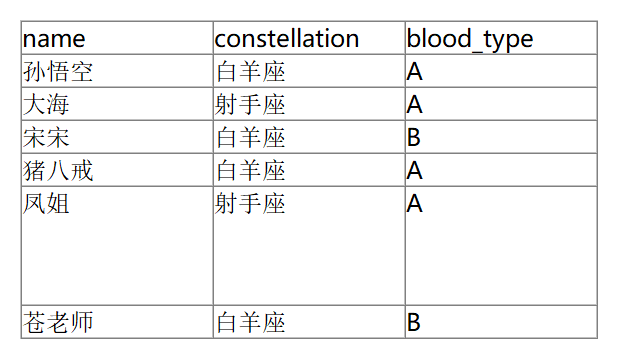
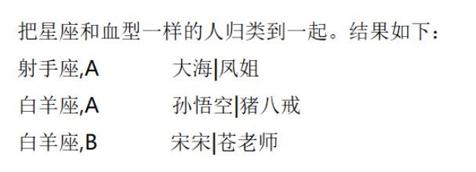
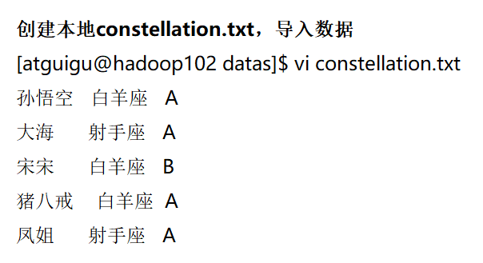
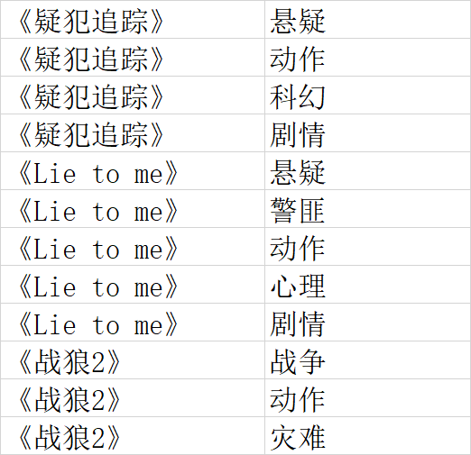

## NVL


## case when

求出不同部门男女各多少人

```sql
select 
  dept_id,
  sum(case sex when '男' then 1 else 0 end) male_count,
  sum(case sex when '女' then 1 else 0 end) female_count
from 
  emp_sex
group by
  dept_id;

```

## 行转列

CONCAT(string A/col, string B/col…)：返回输入字符串连接后的结果，支持任意个输入字符串;

CONCAT_WS(separator, str1, str2,...)：它是一个特殊形式的 CONCAT()。第一个参数剩余参数间的分隔符。分隔符可以是与剩余参数一样的字符串。如果分隔符是 NULL，返回值也将为 NULL。这个函数会跳过分隔符参数后的任何 NULL 和空字符串。分隔符将被加到被连接的字符串之间;

COLLECT_SET(col)：函数只接受基本数据类型，它的主要作用是将某字段的值进行去重汇总，产生array类型字段。

COLLECT_LIST 不去重

数据准备







```sql
# 创建hive表并导入数据
create table person_info(
name string, 
constellation string, 
blood_type string) 
row format delimited fields terminated by "\t";
load data local inpath "/opt/module/datas/constellation.txt" into table person_info;
# 按需求查询数据
select
    t1.base,
    concat_ws('|', collect_set(t1.name)) name
from
    (select
        name,
        concat(constellation, ",", blood_type) base
    from
        person_info) t1
group by
    t1.base;

```

## 列转行

EXPLODE(col)：将hive一列中复杂的array或者map结构拆分成多行。

LATERAL VIEW

用法：LATERAL VIEW udtf(expression) tableAlias AS columnAlias

解释：用于和split, explode等UDTF一起使用，它能够将一列数据拆成多行数据，在此基础上可以对拆分后的数据进行聚合。

```
movie	category
《疑犯追踪》	悬疑,动作,科幻,剧情
《Lie to me》	悬疑,警匪,动作,心理,剧情
《战狼2》	战争,动作,灾难

```


```
create table movie_info(
    movie string, 
    category string) 
row format delimited fields terminated by "\t";
load data local inpath "/opt/module/datas/movie.txt" into table movie_info;


# 查询
select movie, category,tbl.cate 
from movie_info 
lateral view 
explode(split(category,",")) tbl as cate

```




## 函数分类

根据用户自定义函数类别分为以下三种：

（1）UDF（User-Defined-Function）

​     一进一出

（2）UDAF（User-Defined Aggregation Function）

​     聚集函数，多进一出

​     类似于：count/max/min

（3）UDTF（User-Defined Table-Generating Functions）

​     一进多出

​     如 lateral view explore()


## 窗口函数

>OVER()：指定分析函数工作的数据窗口大小，这个数据窗口大小可能会随着行的变而变化。
>
>CURRENT ROW：当前行
>
>n PRECEDING：往前n行数据
>
>n FOLLOWING：往后n行数据
>
>UNBOUNDED：起点，UNBOUNDED PRECEDING 表示从前面的起点， UNBOUNDED FOLLOWING表示到后面的终点LAG(col,n,default_val)：往前第n行数据
>
>LEAD(col,n, default_val)：往后第n行数据
>
>NTILE(n)：把有序窗口的行分发到指定数据的组中，各个组有编号，编号从1开始，对于每一行，NTILE返回此行所属的组的编号。注意：n必须为int类型。

```
jack,2017-01-01,10
tony,2017-01-02,15
jack,2017-02-03,23
tony,2017-01-04,29
jack,2017-01-05,46
jack,2017-04-06,42
tony,2017-01-07,50
jack,2017-01-08,55
mart,2017-04-08,62
mart,2017-04-09,68
neil,2017-05-10,12
mart,2017-04-11,75
neil,2017-06-12,80
mart,2017-04-13,94


# 建表
create table business(
                         name string,
                         orderdate string,
                         cost int
) ROW FORMAT DELIMITED FIELDS TERMINATED BY ',';
load data local inpath "/opt/module/data/data4" into table business;
```

### 查询在2017年4月份购买过的顾客及总人数

```
select name,count(*) over () 
from business 
where substring(orderdate,1,7) = '2017-04' 
group by name;
```

### 查询顾客的购买明细及月购买总额

```
select name,cost,orderdate,substring(orderdate,1,7) month,sum(cost) over(partition by substring(orderdate,1,7)) from business;
```

### 上述的场景, 将每个顾客的cost按照日期进行累加

```mysql
select name,cost,orderdate,
       --  substring(orderdate,1,7) month,
       -- sum(cost)over(partition by substring(orderdate,1,7)) ,
       sum(cost) over(partition by name order by orderdate asc 
                      rows between unbounded PRECEDING and current row )
from business;
```

rows必须跟在Order by 子句之后，对排序的结果进行限制，使用固定的行数来限制分区中的数据行数量

```mysql
select name,orderdate,cost,
       --  substring(orderdate,1,7) month,
       -- sum(cost)over(partition by substring(orderdate,1,7)) ,
--        sum(cost) over(partition by name order by orderdate asc rows between unbounded PRECEDING and current row ),
--        sum(cost) over(partition by name,substring(orderdate,1,7))
       sum(cost) over(partition by name,substring(orderdate,1,7) order by orderdate asc rows between unbounded PRECEDING and current row)
from business;
```

### 求明细及每个月有哪些顾客来过

```mysql
select name,orderdate,cost,
       collect_set(name)
    over(partition by substring(orderdate ,1,7)) customer
from business;

select name,orderdate,cost,
       concat_ws(",",collect_set(name)
    over(partition by substring(orderdate ,1,7))) customer
from business;
```

### 查看顾客上次的购买时间

```
select name,orderdate,cost,
       lag(orderdate,1,"0000-00-00") over (partition by name order by orderdate) last_cost_date
--        ,lead(orderdate,1,"unkown") over (partition by name order by orderdate) next_cost_date
from business;
```

### 查询前20%时间的订单信息

```
select * from (
    select name,orderdate,cost, ntile(5) over(order by orderdate) sorted
    from business
) t
where sorted = 1;


select * from (
                  select name,orderdate,cost,
                         ntile(5) over(order by orderdate) sorted,
                         percent_rank() over(order by orderdate)
                  from business
              ) t
where sorted = 1;
```

### 那些顾客连续两天来过店里

```mysql
-- 1
select name,orderdate,
       row_number()  over (partition by name order by orderdate) rn
from business;
-- 2
select *,
       date_sub(orderdate,rn) temp
from(
        select name,orderdate,
               row_number()  over (partition by name order by orderdate) rn from business
        ) a;
-- 3
select name, count(*) c
from (
         select *,
                date_sub(orderdate, rn) temp
         from (
                  select name,
                         orderdate,
                         row_number() over (partition by name order by orderdate) rn
                  from business
              ) a
    ) b
group by name, temp
having c > 1
```


## 排名

```
select *,
       rank() over (partition by subject order by score desc )

from score;
```


## 日期

```
select current_date();
select date_add(current_date(),90);
select date_sub(current_date(),90);
```


## 查询一个函数的用法

```
desc function 'date_add'
```

