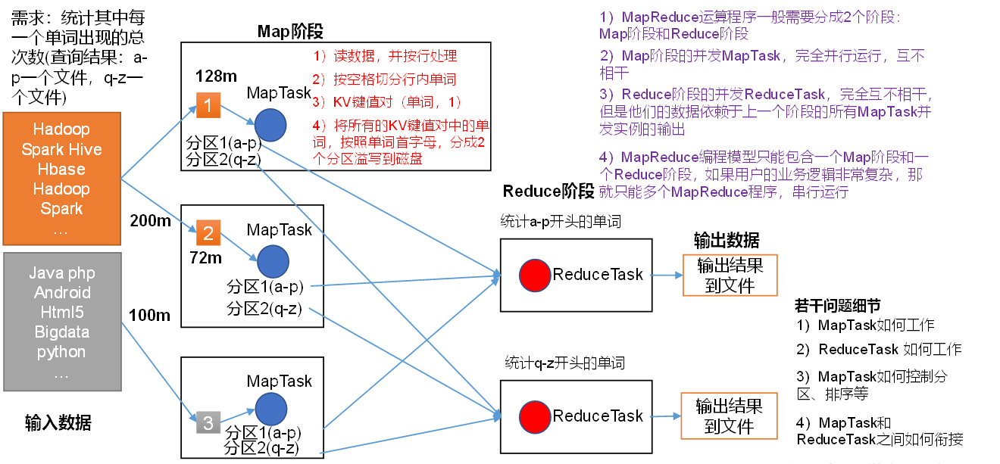

# MapReduce概述

## 定义

mapreduce十一二点分布式运算程序编程框架，使用户开发`基于Hadoop的数据分析应用`的核心框架

Mapreduce核心功能是将用户编写的业务逻辑代码和自带默认组件整合成一个完整的分布式运算程序，并发运行在一个Hadoop集群上

## MR优缺点

### 优

**易于编程；**它简单的实现一些借口就可以完成一个分布式程序，这个分布式程序就可以分布到大量廉价的PC机器上运行。

**良好的扩张性；**性能不足的时候可以简单的增加机器来扩展运算能力；

**高容错性**MR设计初衷是使程序能够部署在廉价的PC机器上，这就是要求它具有很高的容错性。比如一台机器挂掉之后，它原本的计算任务会被转移到里一个节点上进行，不至于使这个任务运行失败。

**适合PB级别以上海量数据的离线处理**

### 缺点

不擅长实时计算；不擅长流式计算（mr输入集是静态的，不能动态变化）；不擅长DAG有向图计算（多个应用程序存在依赖关系后一个应用程序的输入依赖前一个的输出，mr实现出来的DAG会造成大量的IO，导致性能非常低下）；

## MapReduce核心思想

分布式的运算程序往往需要分成至少2个阶段。

（2）第一个阶段的MapTask并发实例，完全并行运行，互不相干。

（3）第二个阶段的ReduceTask并发实例互不相干，但是他们的数据依赖于上一个阶段的所有MapTask并发实例的输出。

（4）MapReduce编程模型只能包含一个Map阶段和一个Reduce阶段，如果用户的业务逻辑非常复杂，那就只能多个MapReduce程序，串行运行。

总结：分析WordCount数据流走向深入理解MapReduce核心思想

## MapReduce进程

（1）**MrAppMaster**：负责整个程序的过程调度及状态协调。

（2）**MapTask**：负责Map阶段的整个数据处理流程。

（3）**ReduceTask**：负责Reduce阶段的整个数据处理流程。