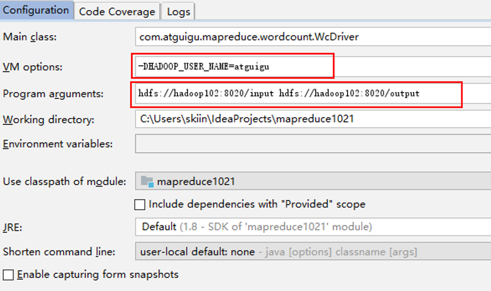

## 需求

在给定的文本文件中统计输出每一个单词出现的总次数

## 编码

按照MapReduce编程规范，分别编写Mapper，Reducer，Driver

### 环境

创建maven工程

在pom.xml文件中添加依赖

```
<dependencies>
    <dependency>
        <groupId>junit</groupId>
        <artifactId>junit</artifactId>
        <version>4.12</version>
    </dependency>
    <dependency>
        <groupId>org.apache.logging.log4j</groupId>
        <artifactId>log4j-slf4j-impl</artifactId>
        <version>2.12.0</version>
    </dependency>
    <dependency>
        <groupId>org.apache.hadoop</groupId>
        <artifactId>hadoop-client</artifactId>
        <version>3.1.3</version>
    </dependency>
</dependencies>

```

项目的src/main/resources目录下，新建一个文件，命名为“log4j2.xml”

```
<?xml version="1.0" encoding="UTF-8"?>
<Configuration status="error" strict="true" name="XMLConfig">
    <Appenders>
        <!-- 类型名为Console，名称为必须属性 -->
        <Appender type="Console" name="STDOUT">
            <!-- 布局为PatternLayout的方式，
            输出样式为[INFO] [2018-01-22 17:34:01][org.test.Console]I'm here -->
            <Layout type="PatternLayout"
                    pattern="[%p] [%d{yyyy-MM-dd HH:mm:ss}][%c{10}]%m%n" />
        </Appender>

    </Appenders>

    <Loggers>
        <!-- 可加性为false -->
        <Logger name="test" level="info" additivity="false">
            <AppenderRef ref="STDOUT" />
        </Logger>

        <!-- root loggerConfig设置 -->
        <Root level="info">
            <AppenderRef ref="STDOUT" />
        </Root>
    </Loggers>

</Configuration>

```

编写Mapper类

```java
import java.io.IOException;
import org.apache.hadoop.io.IntWritable;
import org.apache.hadoop.io.LongWritable;
import org.apache.hadoop.io.Text;
import org.apache.hadoop.mapreduce.Mapper;

public class WordcountMapper extends Mapper<LongWritable, Text, Text, IntWritable>{
	
	Text k = new Text();
	IntWritable v = new IntWritable(1);
	
	@Override
	protected void map(LongWritable key, Text value, Context context)	throws IOException, InterruptedException {
		
		// 1 获取一行
		String line = value.toString();
		
		// 2 切割
		String[] words = line.split(" ");
		
		// 3 输出
		for (String word : words) {
			
			k.set(word);
			context.write(k, v);
		}
	}
}
```

编写Reducer类

```
import java.io.IOException;
import org.apache.hadoop.io.IntWritable;
import org.apache.hadoop.io.Text;
import org.apache.hadoop.mapreduce.Reducer;

public class WordcountReducer extends Reducer<Text, IntWritable, Text, IntWritable>{

int sum;
IntWritable v = new IntWritable();

	@Override
	protected void reduce(Text key, Iterable<IntWritable> values,Context context) throws IOException, InterruptedException {
		
		// 1 累加求和
		sum = 0;
		for (IntWritable count : values) {
			sum += count.get();
		}
		
		// 2 输出
       v.set(sum);
		context.write(key,v);
	}
}
```

编写Dirver

```
import java.io.IOException;
import org.apache.hadoop.conf.Configuration;
import org.apache.hadoop.fs.Path;
import org.apache.hadoop.io.IntWritable;
import org.apache.hadoop.io.Text;
import org.apache.hadoop.mapreduce.Job;
import org.apache.hadoop.mapreduce.lib.input.FileInputFormat;
import org.apache.hadoop.mapreduce.lib.output.FileOutputFormat;

public class WordcountDriver {

	public static void main(String[] args) throws IOException, ClassNotFoundException, InterruptedException {

		// 1 获取配置信息以及封装任务
		Configuration configuration = new Configuration();
		Job job = Job.getInstance(configuration);

		// 2 设置jar加载路径
		job.setJarByClass(WordcountDriver.class);

		// 3 设置map和reduce类
		job.setMapperClass(WordcountMapper.class);
		job.setReducerClass(WordcountReducer.class);

		// 4 设置map输出
		job.setMapOutputKeyClass(Text.class);
		job.setMapOutputValueClass(IntWritable.class);

		// 5 设置最终输出kv类型
		job.setOutputKeyClass(Text.class);
		job.setOutputValueClass(IntWritable.class);
		
		// 6 设置输入和输出路径
		FileInputFormat.setInputPaths(job, new Path(args[0]));
		FileOutputFormat.setOutputPath(job, new Path(args[1]));

		// 7 提交
		boolean result = job.waitForCompletion(true);

		System.exit(result ? 0 : 1);
	}
}

```

### **本地测试**

（1）需要首先配置好HadoopHome变量以及Windows运行依赖

（2）在Eclipse/Idea上运行程序

### **集群上测试**

用maven打jar包，需要添加的打包插件依赖

注意：**标记红颜色的部分需要替换为自己工程主类**（实际操作我并没有这样操作也能成功，hadoop3.1.3）

```
<build>
		<plugins>
			<plugin>
				<artifactId>maven-compiler-plugin</artifactId>
				<version>2.3.2</version>
				<configuration>
					<source>1.8</source>
					<target>1.8</target>
				</configuration>
			</plugin>
			<plugin>
				<artifactId>maven-assembly-plugin </artifactId>
				<configuration>
					<descriptorRefs>
						<descriptorRef>jar-with-dependencies</descriptorRef>
					</descriptorRefs>
					<archive>
						<manifest>
							<mainClass>com.atguigu.mr.WordcountDriver</mainClass>
						</manifest>
					</archive>
				</configuration>
				<executions>
					<execution>
						<id>make-assembly</id>
						<phase>package</phase>
						<goals>
							<goal>single</goal>
						</goals>
					</execution>
				</executions>
			</plugin>
		</plugins>
</build>

```

将程序打成jar包，然后拷贝到Hadoop集群中

```
hadoop jar  wc.jar
 com.atguigu.wordcount.WordcountDriver /user/atguigu/input /user/atguigu/output

```

### **在Windows上向集群提交任务**

添加必要配置信息，打包，并将Jar包设置到Driver中

```
public class WordcountDriver {

	public static void main(String[] args) throws IOException, ClassNotFoundException, InterruptedException {

		// 1 获取配置信息以及封装任务
		Configuration configuration = new Configuration();

       configuration.set("fs.defaultFS", "hdfs://hadoop102:8020");
       configuration.set("mapreduce.framework.name","yarn");
       configuration.set("mapreduce.app-submission.cross-platform","true");
    configuration.set("yarn.resourcemanager.hostname","hadoop103");

		Job job = Job.getInstance(configuration);

		// 2 设置jar加载路径
		job.setJar("C:\\Users\\skiin\\IdeaProjects\\mapreduce1021\\target\\mapreduce1021-1.0-SNAPSHOT.jar");

		// 3 设置map和reduce类
		job.setMapperClass(WordcountMapper.class);
		job.setReducerClass(WordcountReducer.class);

		// 4 设置map输出
		job.setMapOutputKeyClass(Text.class);
		job.setMapOutputValueClass(IntWritable.class);

		// 5 设置最终输出kv类型
		job.setOutputKeyClass(Text.class);
		job.setOutputValueClass(IntWritable.class);
		
		// 6 设置输入和输出路径
		FileInputFormat.setInputPaths(job, new Path(args[0]));
		FileOutputFormat.setOutputPath(job, new Path(args[1]));

		// 7 提交
		boolean result = job.waitForCompletion(true);

		System.exit(result ? 0 : 1);
	}
}


```




