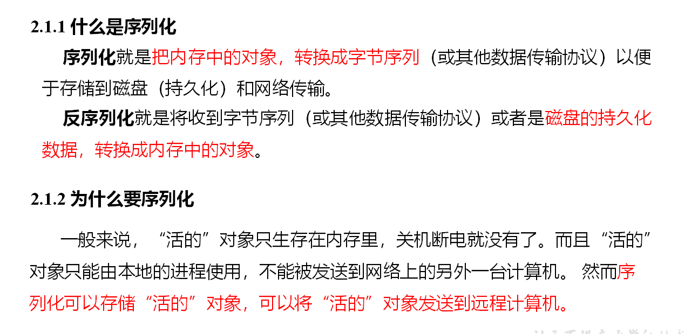

## 序列化概述




## 自定义bean对象实现序列化接口（Writable）

```
必须实现Writable接口
//反序列化时，需要反射调用空参构造函数，所以必须有空参构造
public FlowBean() {
	super();
}
//重写序列化方法
@Override
public void write(DataOutput out) throws IOException {
	out.writeLong(upFlow);
	out.writeLong(downFlow);
	out.writeLong(sumFlow);
}
//重写反序列化方法
@Override
public void readFields(DataInput in) throws IOException {
	upFlow = in.readLong();
	downFlow = in.readLong();
	sumFlow = in.readLong();
}
//注意反序列化的顺序和序列化的顺序完全一致
//要想把结果显示在文件中，需要重写toString()，可用”\t”分开，方便后续用。
public String toString(){}
//如果需要将自定义的bean放在key中传输，则还需要实现Comparable接口，因为MapReduce框中的Shuffle过程要求对key必须能排序。
@Override
public int compareTo(FlowBean o) {
	// 倒序排列，从大到小
	return this.sumFlow > o.getSumFlow() ? -1 : 1;
}


```

## 案例

[见flowbean练习](https://gitee.com/south-monster-bude/hadoop-demo/tree/master/hdfs-mapreduce/src/main/java/org/demo/hdfs/flow)

https://gitee.com/south-monster-bude/hadoop-demo/tree/master/hdfs-mapreduce/src/main/java/org/demo/hdfs/flow