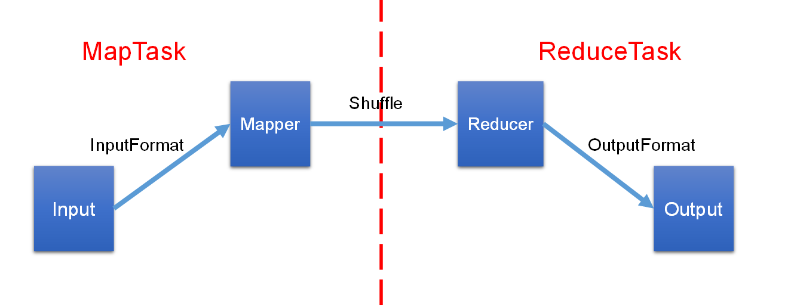
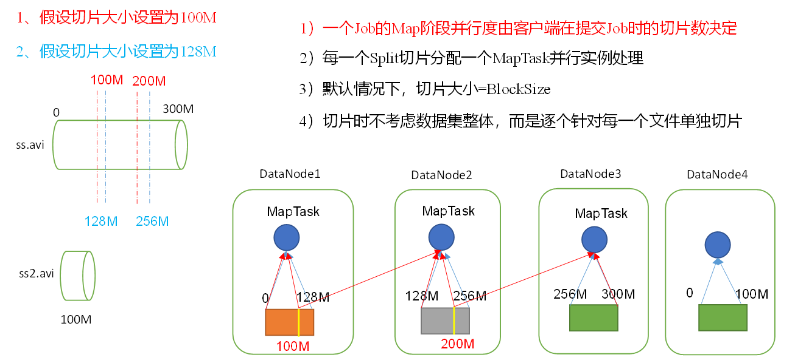
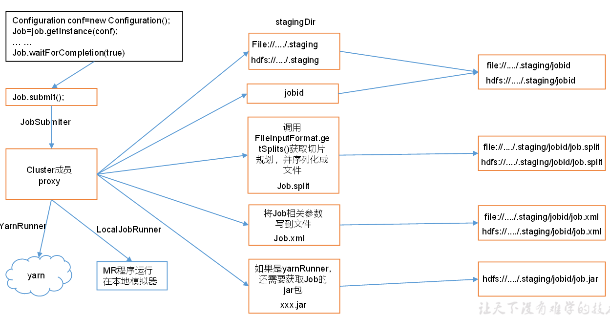
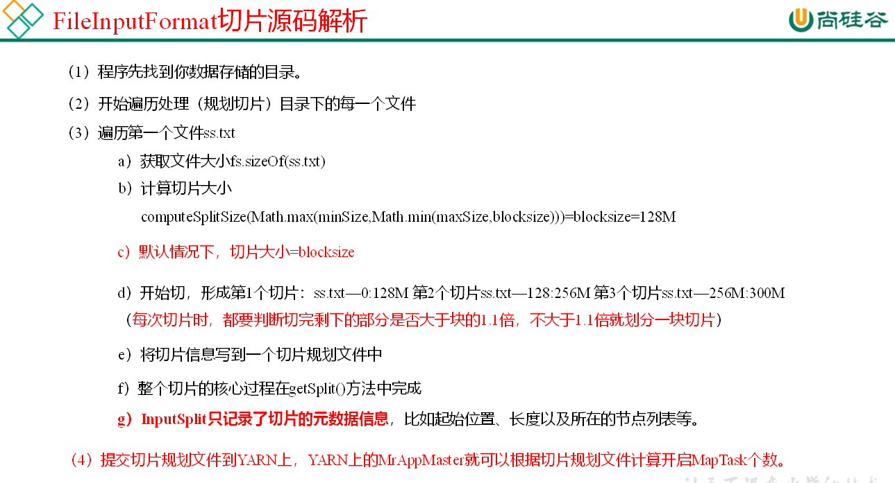
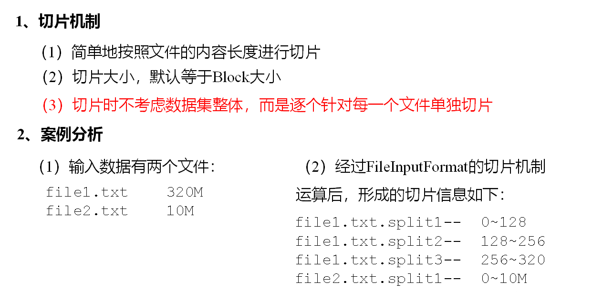
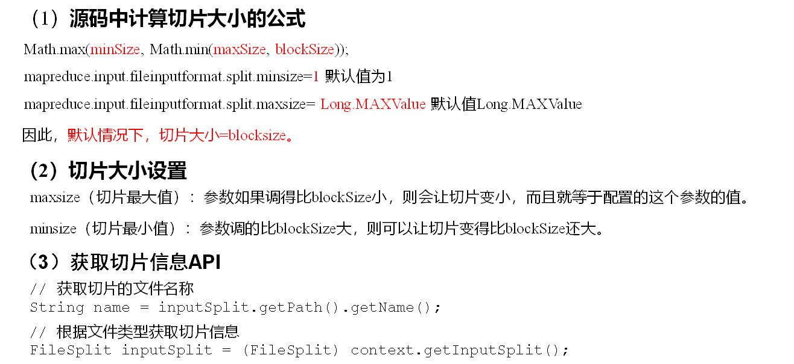
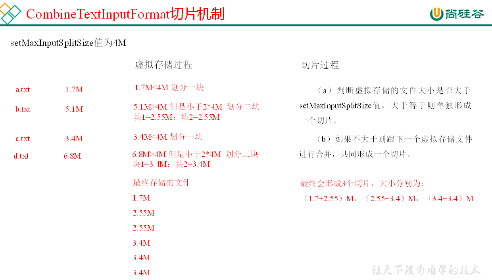
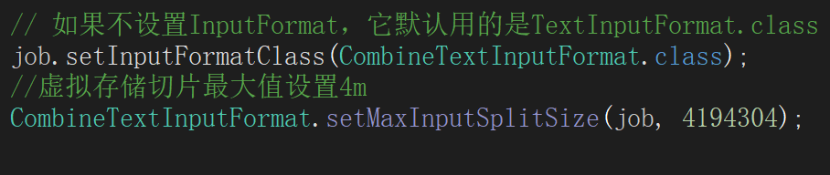
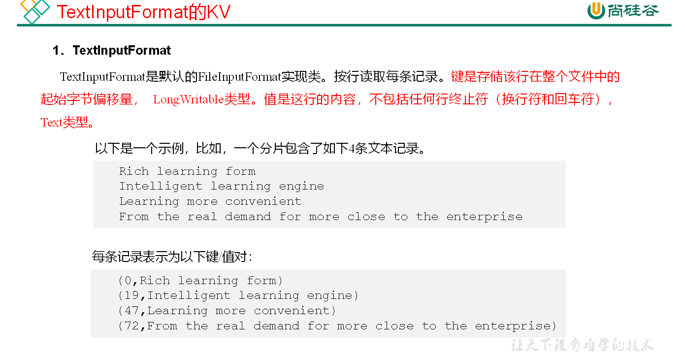

# MapReduce 框架原理



## InputFormat数据输入

**切片与MapTask并行度决定机制**

> mapTask并行度决定Map阶段任务处理并发度，进而影响到整个job的处理速度。

**MapTask并行度决定机制**

> 数据块：block是HDFS物理上把数据分成多块
>
> 数据切片：数据切片是在逻辑上对输入的数据进行分片，并不会在磁盘上将其切分成片进行存储。



## JOB提交流程源码和切片源码



```java
waitForCompletion()
submit();
// 1建立连接
connect();
// 1）创建提交Job的代理
new Cluster(getConfiguration());
// （1）判断是本地yarn还是远程
initialize(jobTrackAddr, conf); 
// 2 提交job
submitter.submitJobInternal(Job.this, cluster)
// 1）创建给集群提交数据的Stag路径
Path jobStagingArea = JobSubmissionFiles.getStagingDir(cluster, conf);
// 2）获取jobid ，并创建Job路径
JobID jobId = submitClient.getNewJobID();
// 3）拷贝jar包到集群
copyAndConfigureFiles(job, submitJobDir);	
rUploader.uploadFiles(job, jobSubmitDir);
// 4）计算切片，生成切片规划文件
writeSplits(job, submitJobDir);
maps = writeNewSplits(job, jobSubmitDir);
input.getSplits(job);
// 5）向Stag路径写XML配置文件
writeConf(conf, submitJobFile);
conf.writeXml(out);
// 6）提交Job,返回提交状态
status = submitClient.submitJob(jobId, submitJobDir.toString(), job.getCredentials());

```

##  FileInputFormat切片机制







## CombineTextInputFormat切片机制

框架默认TextInputFormat切片机制是对任务按文件规划切片，不管文件多小，都会是一个单独的切片，都会交给一个MapTask，这样如果有大量小文件，就会产生大量的MapTask，处理效率极其低下

### **应用场景**

CombineTextInputFormat用于小文件过多的场景，它可以将多个小文件从逻辑上规划到一个切片中，这样，多个小文件就可以交给一个MapTask处理

### **虚拟存储切片最大值设置**

CombineTextInputFormat.setMaxInputSplitSize(job, 4194304)

虚拟存储切片最大值设置最好根据实际的小文件大小情况来设置具体的值

### **切片机制**

生成切片过程包括：虚拟存储过程和切片过程二部分



（1）虚拟存储过程：

将输入目录下所有文件大小，依次和设置的setMaxInputSplitSize值比较，如果不大于设置的最大值，逻辑上划分一个块。如果输入文件大于设置的最大值且大于两倍，那么以最大值切割一块；当剩余数据大小超过设置的最大值且不大于最大值2倍，此时将文件均分成2个虚拟存储块（防止出现太小切片）。

例如setMaxInputSplitSize值为4M，输入文件大小为8.02M，则先逻辑上分成一个4M。剩余的大小为4.02M，如果按照4M逻辑划分，就会出现0.02M的小的虚拟存储文件，所以将剩余的4.02M文件切分成（2.01M和2.01M）两个文件。

（2）切片过程：

（a）判断虚拟存储的文件大小是否大于setMaxInputSplitSize值，大于等于则单独形成一个切片。

（b）如果不大于则跟下一个虚拟存储文件进行合并，共同形成一个切片。

（c）测试举例：有4个小文件大小分别为1.7M、5.1M、3.4M以及6.8M这四个小文件，则虚拟存储之后形成6个文件块，大小分别为：

1.7M，（2.55M、2.55M），3.4M以及（3.4M、3.4M）

最终会形成3个切片，大小分别为：

（1.7+2.55）M，（2.55+3.4）M，（3.4+3.4）M

## 案例练习

https://gitee.com/south-monster-bude/hadoop-demo/tree/master/hdfs-mapreduce/src/main/java/org/demo/hdfs/mr



## TextInputFormat的KV

