## MapReduce工作流程


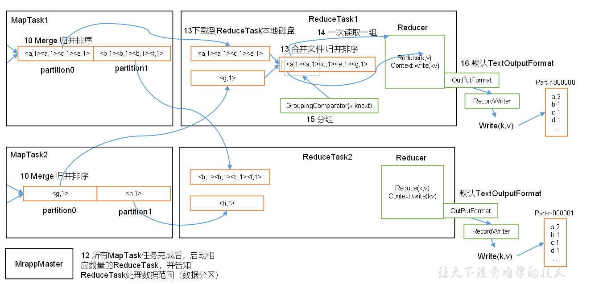

（1）MapTask收集我们的map()方法输出的kv对，放到内存缓冲区中

（2）从内存缓冲区不断溢出本地磁盘文件，可能会溢出多个文件

（3）多个溢出文件会被合并成大的溢出文件

（4）在溢出过程及合并的过程中，都要调用Partitioner进行分区和针对key进行排序

（5）ReduceTask根据自己的分区号，去各个MapTask机器上取相应的结果分区数据

（6）ReduceTask会取到同一个分区的来自不同MapTask的结果文件，ReduceTask会将这些文件再进行合并（归并排序）

（7）合并成大文件后，Shuffle的过程也就结束了，后面进入ReduceTask的逻辑运算过程（从文件中取出一个一个的键值对Group，调用用户自定义的reduce()方法）

**注意：**

（1）Shuffle中的缓冲区大小会影响到MapReduce程序的执行效率，原则上说，缓冲区越大，磁盘io的次数越少，执行速度就越快。

（2）缓冲区的大小可以通过参数调整，参数：io.sort.mb默认100M。

（3）源码解析流程

```java
context.write(k, NullWritable.get());
output.write(key, value);
collector.collect(key, value,partitioner.getPartition(key, value, partitions));
HashPartitioner();
collect();
close();
collect.flush();
sortAndSpill();
sort()//QuickSort
mergeParts();                         
collector.close();
```

##  Shuffle机制

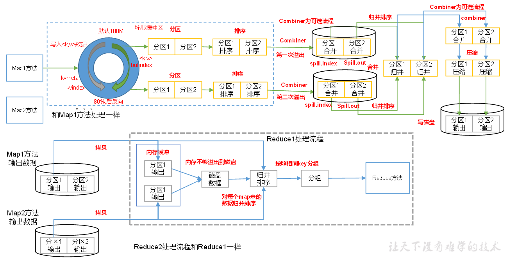

Map方法之后，Reduce方法之前的数据处理过程称之为Shuffle。


## Partition分区

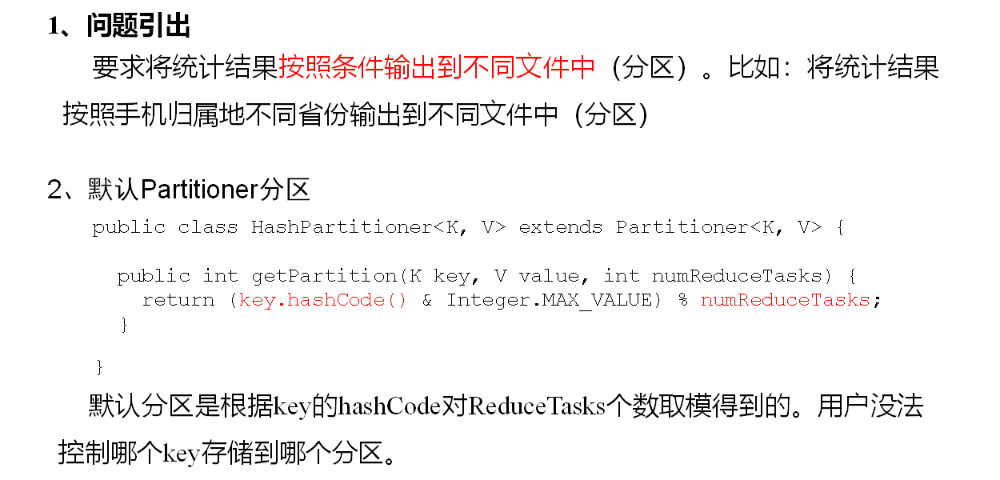

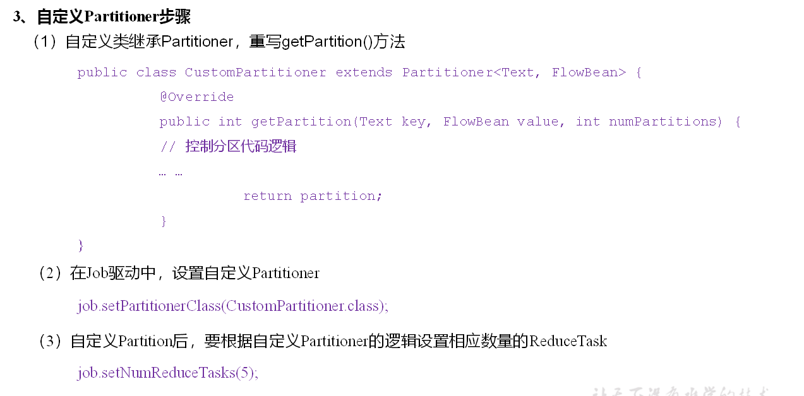

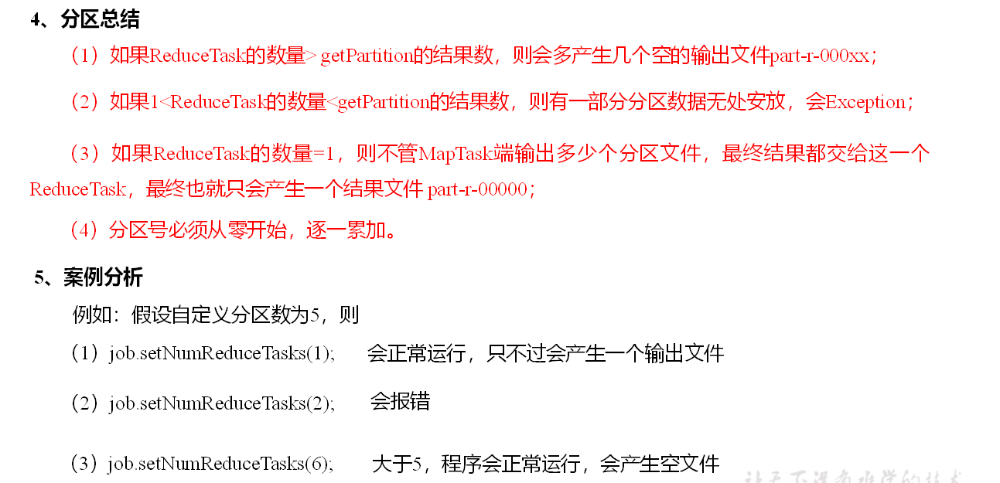

案例参考

[Partition分区案例实操](https://gitee.com/south-monster-bude/hadoop-demo/tree/master/hdfs-mapreduce/src/main/java/org/demo/hdfs/patitioner)

Driver中Job设置

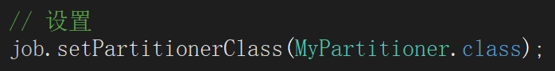

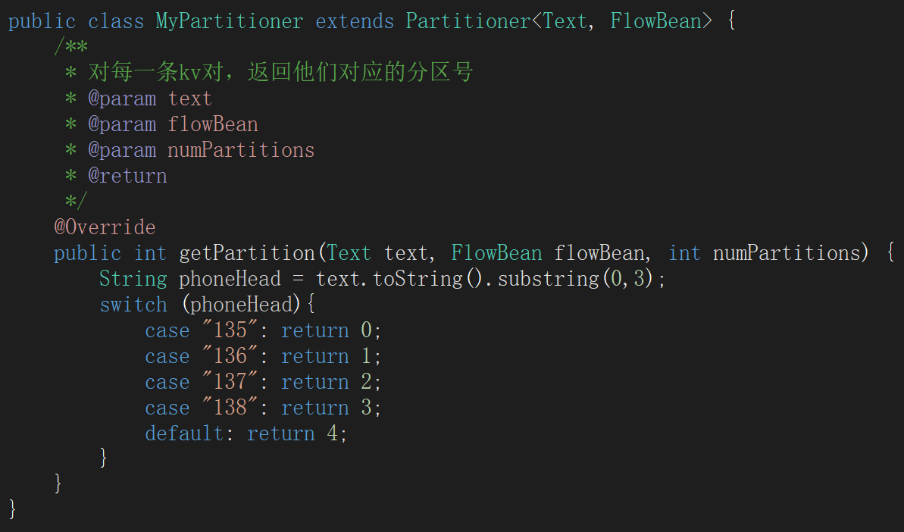

## WritableComparable排序

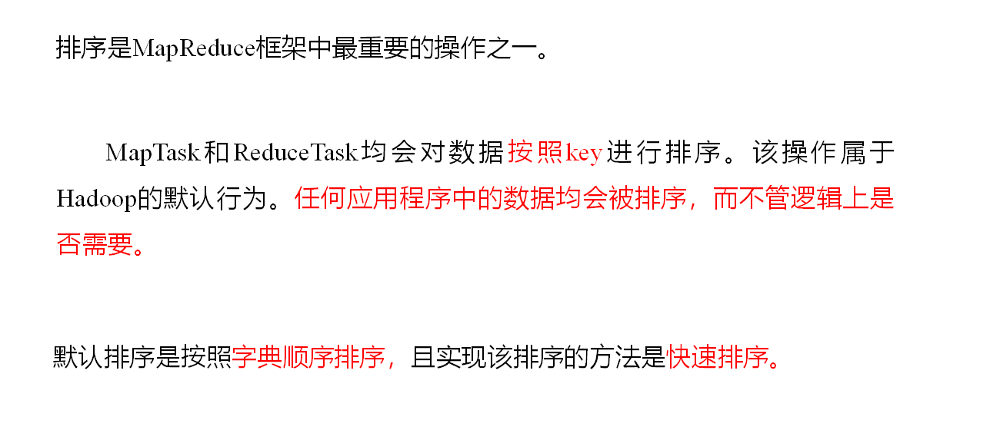

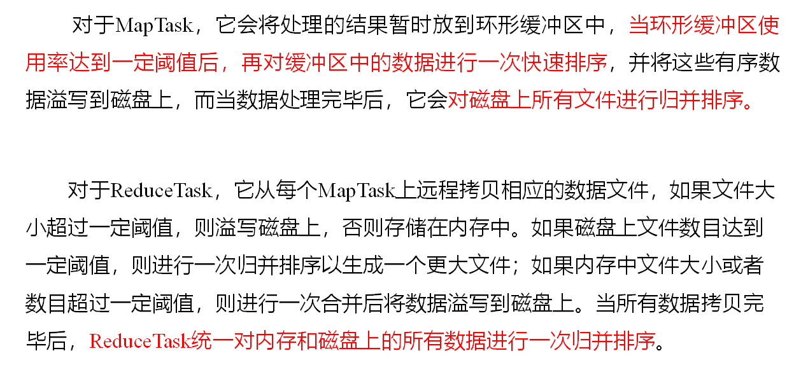

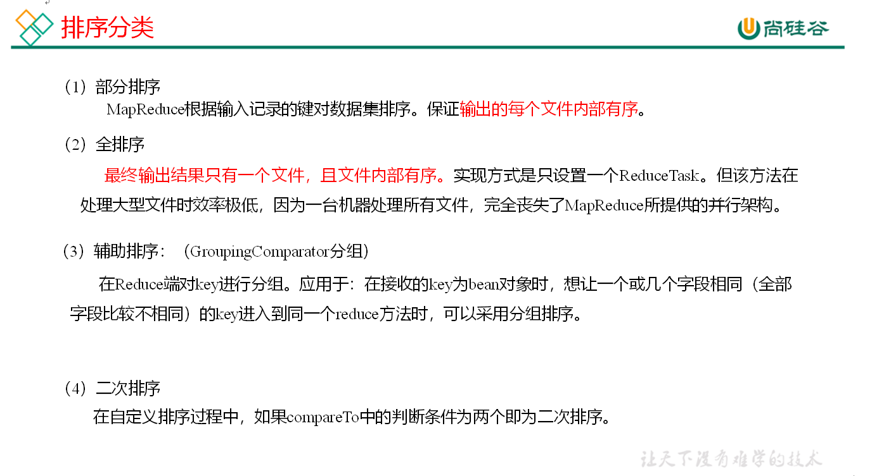

案例参考

[定义排序WritableComparable原理分析](https://gitee.com/south-monster-bude/hadoop-demo/tree/master/hdfs-mapreduce/src/main/java/org/demo/hdfs/compare)

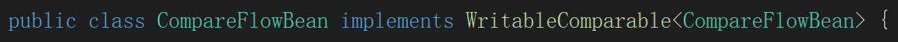

###  WritableComparable排序案例实操（区内排序）

**1****）需求**

要求每个省份手机号输出的文件中按照总流量内部排序。

**2****）需求分析**

​    基于前一个需求，增加自定义分区类，分区按照省份手机号设置。

**3****）案例实操**

```
import org.apache.hadoop.io.Text;
import org.apache.hadoop.mapreduce.Partitioner;

public class ProvincePartitioner extends Partitioner<FlowBean, Text> {

	@Override
	public int getPartition(FlowBean key, Text value, int numPartitions) {
		
		// 1 获取手机号码前三位
		String preNum = value.toString().substring(0, 3);
		
		int partition = 4;
		
		// 2 根据手机号归属地设置分区
		if ("136".equals(preNum)) {
			partition = 0;
		}else if ("137".equals(preNum)) {
			partition = 1;
		}else if ("138".equals(preNum)) {
			partition = 2;
		}else if ("139".equals(preNum)) {
			partition = 3;
		}

		return partition;
	}
}

```

```
// 加载自定义分区类
job.setPartitionerClass(ProvincePartitioner.class);
// 设置Reducetask个数
job.setNumReduceTasks(5);
```


## Combiner合并

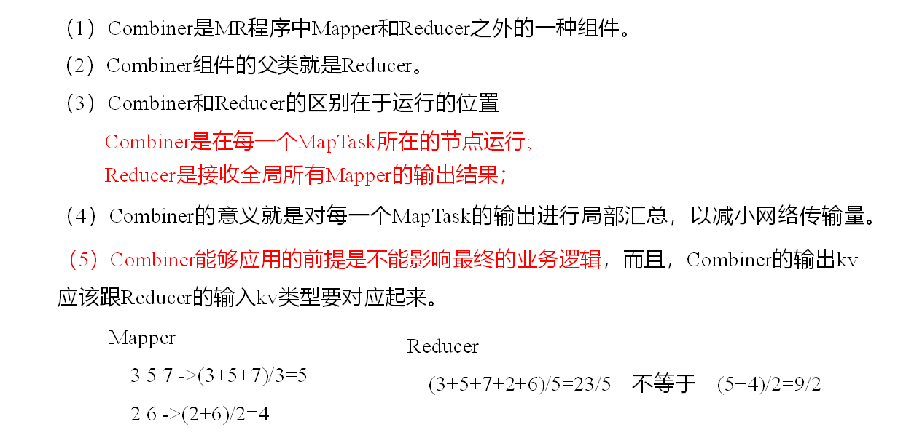

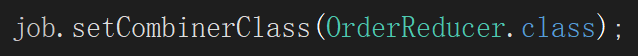

 [Combiner合并案例实操](https://gitee.com/south-monster-bude/hadoop-demo/tree/master/hdfs-mapreduce/src/main/java/org/demo/hdfs/grouping)

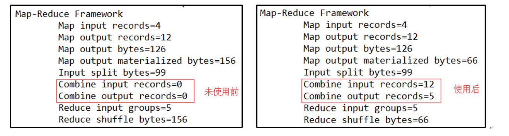

## MapTask工作机制

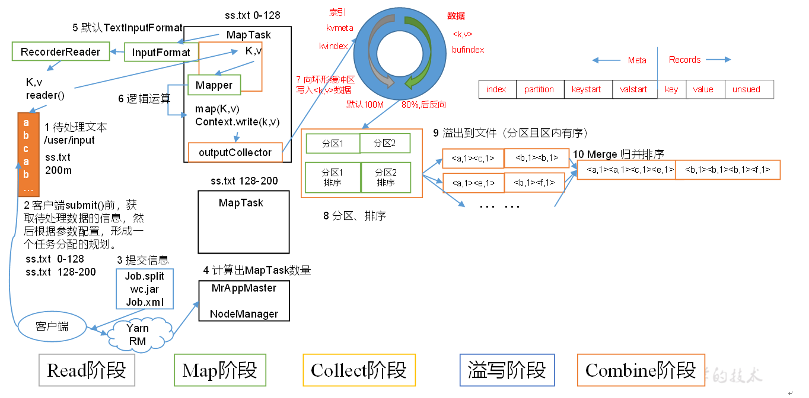

（1）Read阶段：MapTask通过用户编写的RecordReader，从输入InputSplit中解析出一个个key/value。

​    （2）Map阶段：该节点主要是将解析出的key/value交给用户编写map()函数处理，并产生一系列新的key/value。

​    （3）Collect收集阶段：在用户编写map()函数中，当数据处理完成后，一般会调用OutputCollector.collect()输出结果。在该函数内部，它会将生成的key/value分区（调用Partitioner），并写入一个环形内存缓冲区中。

​    （4）Spill阶段：即“溢写”，当环形缓冲区满后，MapReduce会将数据写到本地磁盘上，生成一个临时文件。需要注意的是，将数据写入本地磁盘之前，先要对数据进行一次本地排序，并在必要时对数据进行合并、压缩等操作。

​    **溢写阶段详情：**

   步骤1：利用快速排序算法对缓存区内的数据进行排序，排序方式是，先按照分区编号Partition进行排序，然后按照key进行排序。这样，经过排序后，数据以分区为单位聚集在一起，且同一分区内所有数据按照key有序。

​    步骤2：按照分区编号由小到大依次将每个分区中的数据写入任务工作目录下的临时文件output/spillN.out（N表示当前溢写次数）中。如果用户设置了Combiner，则写入文件之前，对每个分区中的数据进行一次聚集操作。

​    步骤3：将分区数据的元信息写到内存索引数据结构SpillRecord中，其中每个分区的元信息包括在临时文件中的偏移量、压缩前数据大小和压缩后数据大小。如果当前内存索引大小超过1MB，则将内存索引写到文件output/spillN.out.index中。

​    （5）Combine阶段：当所有数据处理完成后，MapTask对所有临时文件进行一次合并，以确保最终只会生成一个数据文件。

​    当所有数据处理完后，MapTask会将所有临时文件合并成一个大文件，并保存到文件output/file.out中，同时生成相应的索引文件output/file.out.index。

​    在进行文件合并过程中，MapTask以分区为单位进行合并。对于某个分区，它将采用多轮递归合并的方式。每轮合并io.sort.factor（默认10）个文件，并将产生的文件重新加入待合并列表中，对文件排序后，重复以上过程，直到最终得到一个大文件。

​    让每个MapTask最终只生成一个数据文件，可避免同时打开大量文件和同时读取大量小文件产生的随机读取带来的开销。


## ReduceTask工作机制

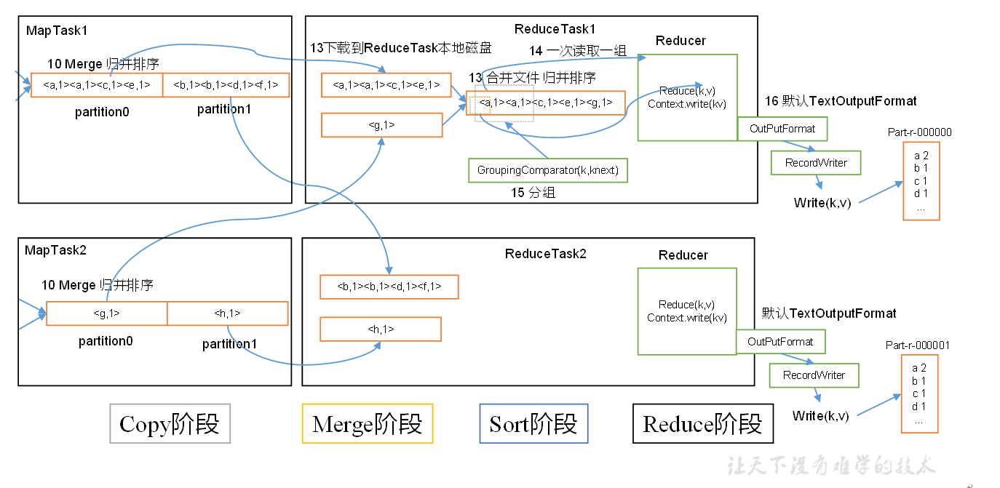

（1）Copy阶段：ReduceTask从各个MapTask上远程拷贝一片数据，并针对某一片数据，如果其大小超过一定阈值，则写到磁盘上，否则直接放到内存中。

​    （2）Merge阶段：在远程拷贝数据的同时，ReduceTask启动了两个后台线程对内存和磁盘上的文件进行合并，以防止内存使用过多或磁盘上文件过多。

​    （3）Sort阶段：按照MapReduce语义，用户编写reduce()函数输入数据是按key进行聚集的一组数据。为了将key相同的数据聚在一起，Hadoop采用了基于排序的策略。由于各个MapTask已经实现对自己的处理结果进行了局部排序，因此，ReduceTask只需对所有数据进行一次归并排序即可。

​    （4）Reduce阶段：reduce()函数将计算结果写到HDFS上。

**设置ReduceTask并行度（个数）**

ReduceTask的并行度同样影响整个Job的执行并发度和执行效率，但与MapTask的并发数由切片数决定不同，ReduceTask数量的决定是可以直接手动设置：

// 默认值是1，手动设置为4

job.setNumReduceTasks(4);

### 实验：测试ReduceTask多少合适

（1）实验环境：1个Master节点，16个Slave节点：CPU:8GHZ，内存: 2G

（2）实验结论：

表 改变ReduceTask （数据量为1GB）

| MapTask=16 |      |      |      |      |      |      |      |      |      |      |
| ---------- | ---- | ---- | ---- | ---- | ---- | ---- | ---- | ---- | ---- | ---- |
| ReduceTask | 1    | 5    | 10   | 15   | 16   | 20   | 25   | 30   | 45   | 60   |
| 总时间     | 892  | 146  | 110  | 92   | 88   | 100  | 128  | 101  | 145  | 104  |

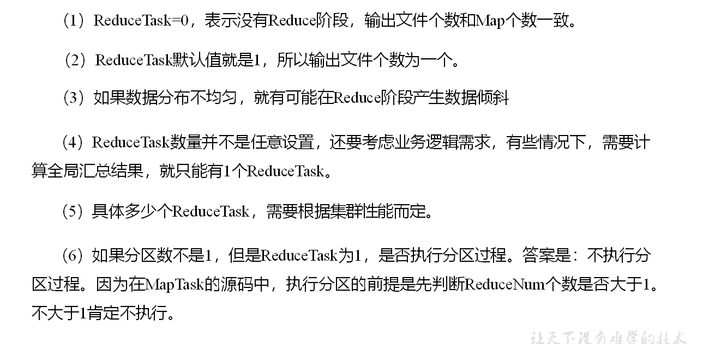

## OutputFormat数据输出

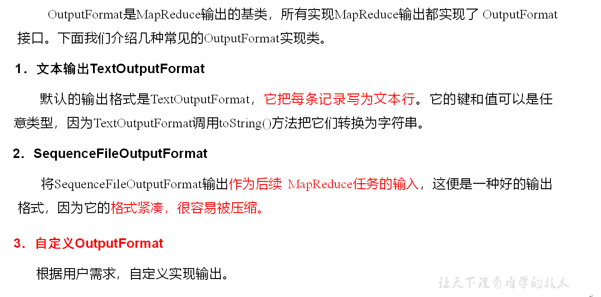

### 自定义OutputFormat

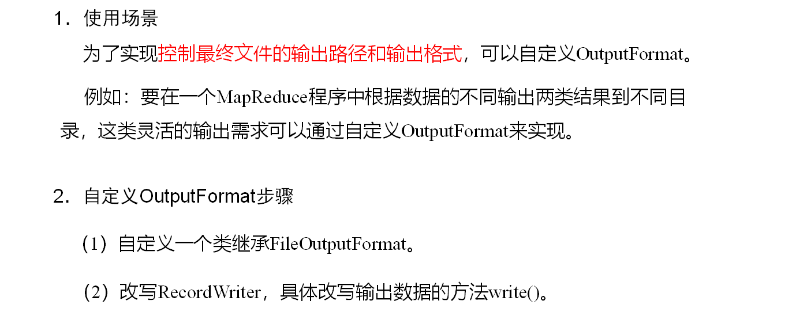

[自定义OutputFormat案例实操](https://gitee.com/south-monster-bude/hadoop-demo/tree/master/hdfs-mapreduce/src/main/java/org/demo/hdfs/outputformat)

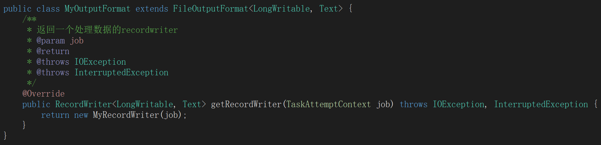

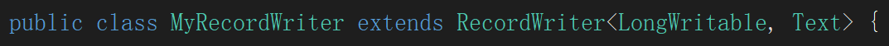

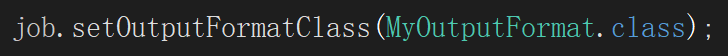

## Reduce Join

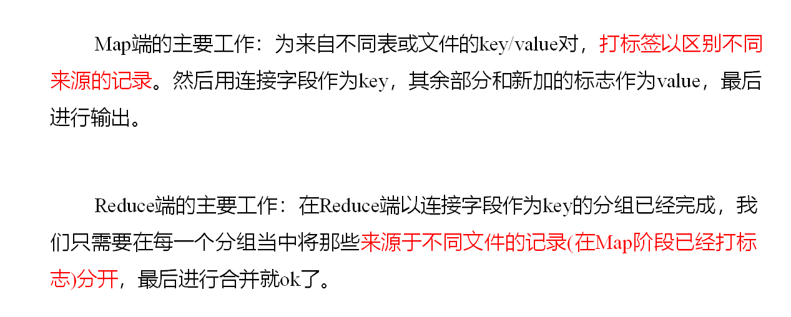

[Reduce Join案例实操](https://gitee.com/south-monster-bude/hadoop-demo/tree/master/hdfs-mapreduce/src/main/java/org/demo/hdfs/reducejoin)

**注意：**

这种方式中合并的操作是reduce阶段完成，Reduce端处理压力太大，Map节点运算负载很低，资源利用率不高，且在Reduce阶段极易产生数据倾斜

所以Map阶段可以实现数据合并，减少Reduce的压力


## Map Join

**1）使用场景**

Map Join适用于一张表十分小、一张表很大的场景。

**2）优点**

思考：在Reduce端处理过多的表，非常容易产生数据倾斜。怎么办？

在Map端缓存多张表，提前处理业务逻辑，这样增加Map端业务，减少Reduce端数据的压力，尽可能的减少数据倾斜。

**3）具体办法：采用DistributedCache**

​    （1）在Mapper的setup阶段，将文件读取到缓存集合中。

​    （2）在驱动函数中加载缓存。

// 缓存普通文件到Task运行节点。

job.addCacheFile(new URI("file://e:/cache/pd.txt"));


[MapJoin案例](https://gitee.com/south-monster-bude/hadoop-demo/tree/master/hdfs-mapreduce/src/main/java/org/demo/hdfs/mapjoin)


## 计数器应用

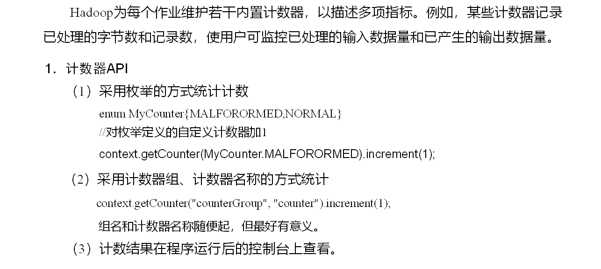

[计数器案例 - 数据清洗 ETL](https://gitee.com/south-monster-bude/hadoop-demo/tree/master/hdfs-mapreduce/src/main/java/org/demo/hdfs/etl)

在运行核心业务MapReduce程序之前，往往要先对数据进行清洗，清理掉不符合用户要求的数据。清理的过程往往只需要运行Mapper程序，不需要运行Reduce程序。

**1）需求**

去除日志中字段个数小于等于11的日志。

（1）输入数据  日志文件

（2）期望输出数据

每行字段长度都大于11。

**2）需求分析**

需要在Map阶段对输入的数据根据规则进行过滤清洗。

## 总结

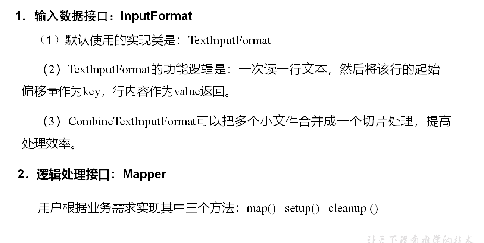


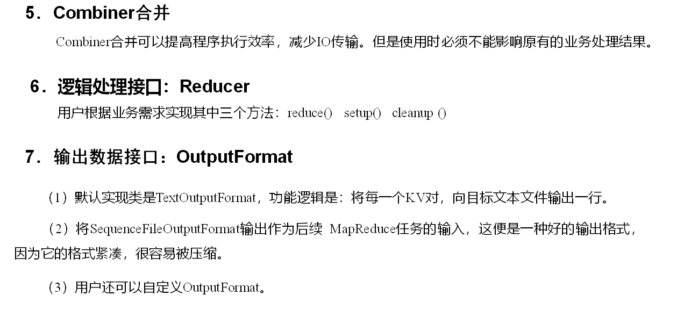