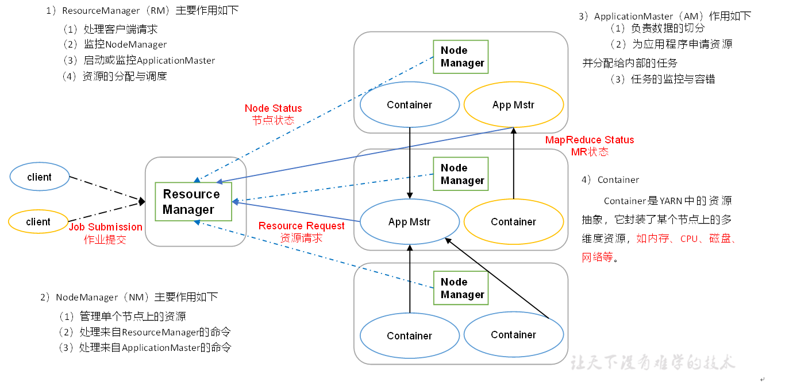
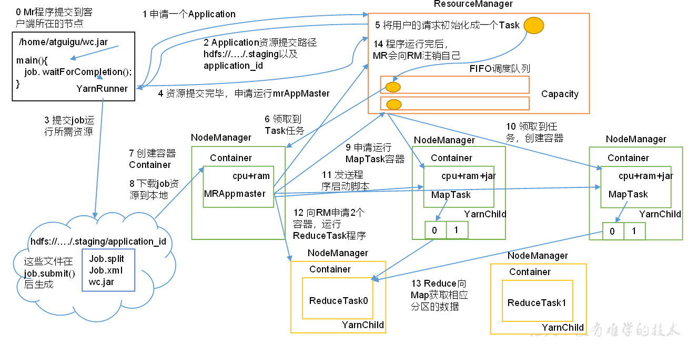
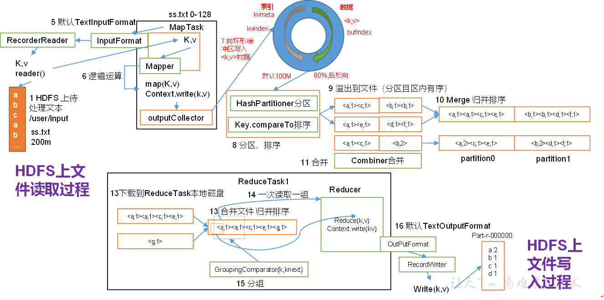
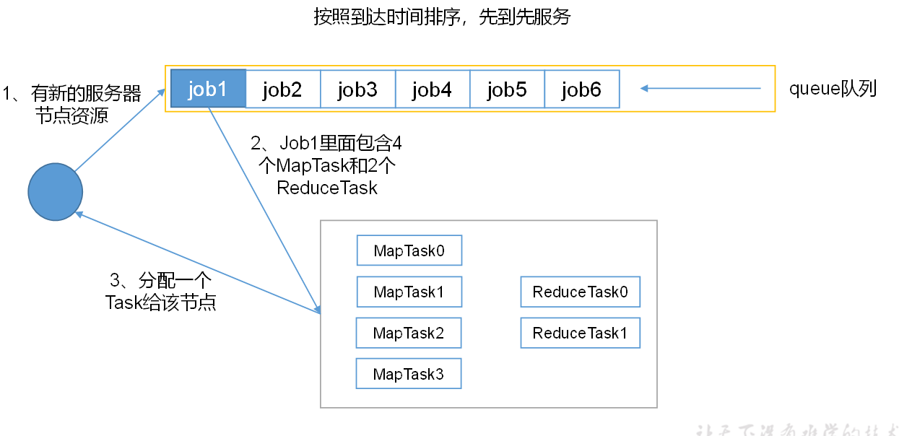
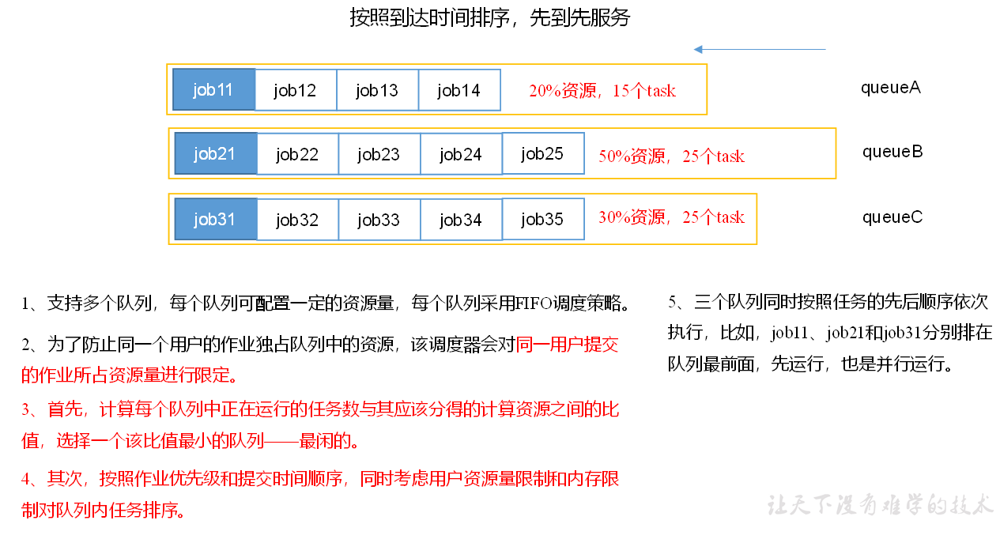
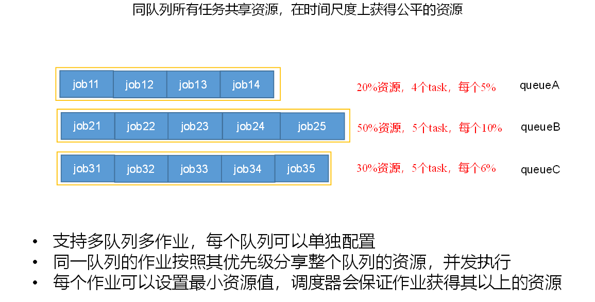
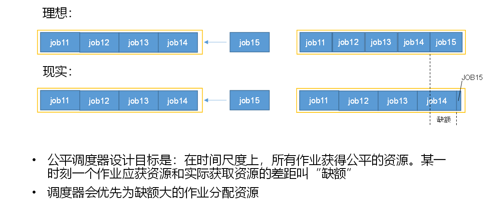
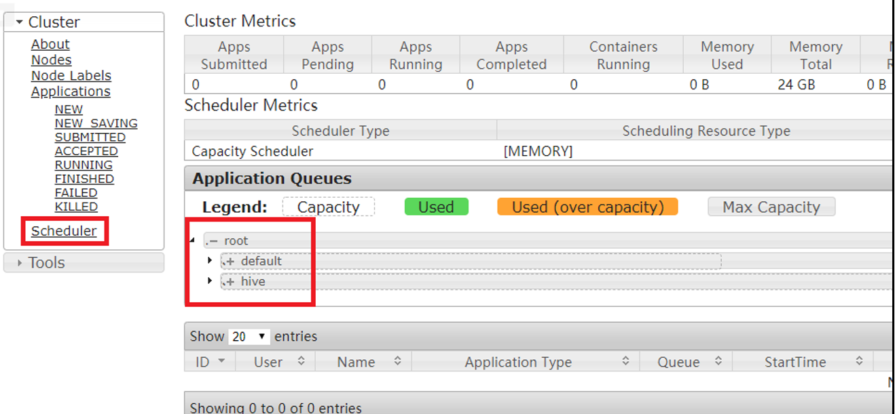
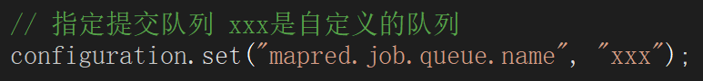

## Yarn资源调度器

Yarn是一个资源调度平台，负责为运算程序提供服务器运算资源，相当于一个分布式的操作系统平台，而MapReduce等运算程序则相当于运行于操作系统之上的应用程序

## Yarn基本架构

YARN主要由ResourceManager、NodeManager、ApplicationMaster和Container等组件构成。



##  Yarn工作机制



（1）MR程序提交到客户端所在的节点。

​    （2）YarnRunner向ResourceManager申请一个Application。

​    （3）RM将该应用程序的资源路径返回给YarnRunner。

​    （4）该程序将运行所需资源提交到HDFS上。

​    （5）程序资源提交完毕后，申请运行mrAppMaster。

​    （6）RM将用户的请求初始化成一个Task。

​    （7）其中一个NodeManager领取到Task任务。

​    （8）该NodeManager创建容器Container，并产生MRAppmaster。

​    （9）Container从HDFS上拷贝资源到本地。

​    （10）MRAppmaster向RM 申请运行MapTask资源。

​    （11）RM将运行MapTask任务分配给另外两个NodeManager，另两个NodeManager分别领取任务并创建容器。

​    （12）MR向两个接收到任务的NodeManager发送程序启动脚本，这两个NodeManager分别启动MapTask，MapTask对数据分区排序。

（13）MrAppMaster等待所有MapTask运行完毕后，向RM申请容器，运行ReduceTask。

​    （14）ReduceTask向MapTask获取相应分区的数据。

​    （15）程序运行完毕后，MR会向RM申请注销自己。

## 作业提交全过程

（1）作业提交

第1步：Client调用job.waitForCompletion方法，向整个集群提交MapReduce作业。

第2步：Client向RM申请一个作业id。

第3步：RM给Client返回该job资源的提交路径和作业id。

第4步：Client提交jar包、切片信息和配置文件到指定的资源提交路径。

第5步：Client提交完资源后，向RM申请运行MrAppMaster。

（2）作业初始化

第6步：当RM收到Client的请求后，将该job添加到容量调度器中。

第7步：某一个空闲的NM领取到该Job。

第8步：该NM创建Container，并产生MRAppmaster。

第9步：下载Client提交的资源到本地。

（3）任务分配

第10步：MrAppMaster向RM申请运行多个MapTask任务资源。

第11步：RM将运行MapTask任务分配给另外两个NodeManager，另两个NodeManager分别领取任务并创建容器。

（4）任务运行

第12步：MR向两个接收到任务的NodeManager发送程序启动脚本，这两个NodeManager分别启动MapTask，MapTask对数据分区排序。

第13步：MrAppMaster等待所有MapTask运行完毕后，向RM申请容器，运行ReduceTask。

第14步：ReduceTask向MapTask获取相应分区的数据。

第15步：程序运行完毕后，MR会向RM申请注销自己。

（5）进度和状态更新

YARN中的任务将其进度和状态(包括counter)返回给应用管理器, 客户端每秒(通过mapreduce.client.progressmonitor.pollinterval设置)向应用管理器请求进度更新, 展示给用户。

（6）作业完成

除了向应用管理器请求作业进度外, 客户端每5秒都会通过调用waitForCompletion()来检查作业是否完成。时间间隔可以通过mapreduce.client.completion.pollinterval来设置。作业完成之后, 应用管理器和Container会清理工作状态。作业的信息会被作业历史服务器存储以备之后用户核查。



## 资源调度器

Hadoop作业调度器主要有三种：FIFO、Capacity Scheduler和Fair Scheduler。Hadoop3.1.3默认的资源调度器是Capacity Scheduler

**具体设置详见：yarn-default.xml文件**

```
<property>
    <description>The class to use as the resource scheduler.</description>
    <name>yarn.resourcemanager.scheduler.class</name>
<value>org.apache.hadoop.yarn.server.resourcemanager.scheduler.capacity.CapacityScheduler</value>
</property>

```

**先进先出调度器** **FIFO**



**容量调度器** **Capacity Scheduler**



**公平调度器** **Fair Scheduler**





### 容量调度器多队列提交案例

### 4.5.1 需求

​    Yarn默认的容量调度器是一条单队列的调度器，在实际使用中会出现单个任务阻塞整个队列的情况。同时，随着业务的增长，公司需要分业务限制集群使用率。这就需要我们按照业务种类配置多条任务队列。

### 4.5.2 配置多队列的容量调度器

默认Yarn的配置下，容量调度器只有一条Default队列。在capacity-scheduler.xml中可以配置多条队列，并降低default队列资源占比：

```
<property>
    <name>yarn.scheduler.capacity.root.queues</name>
    <value>default,hive</value>
    <description>
      The queues at the this level (root is the root queue).
    </description>
</property>
<property>
    <name>yarn.scheduler.capacity.root.default.capacity</name>
    <value>40</value>
</property>
```


同时为新加队列添加必要属性：

```
<property>
    <name>yarn.scheduler.capacity.root.hive.capacity</name>
    <value>60</value>
</property>

<property>
    <name>yarn.scheduler.capacity.root.hive.user-limit-factor</name>
    <value>1</value>
</property>

<property>
    <name>yarn.scheduler.capacity.root.hive.maximum-capacity</name>
    <value>80</value>
</property>

<property>
    <name>yarn.scheduler.capacity.root.hive.state</name>
    <value>RUNNING</value>
</property>

<property>
    <name>yarn.scheduler.capacity.root.hive.acl_submit_applications</name>
    <value>*</value>
</property>

<property>
    <name>yarn.scheduler.capacity.root.hive.acl_administer_queue</name>
    <value>*</value>
</property>

<property>
    <name>yarn.scheduler.capacity.root.hive.acl_application_max_priority</name>
    <value>*</value>
</property>

<property>
    <name>yarn.scheduler.capacity.root.hive.maximum-application-lifetime</name>
    <value>-1</value>
</property>

<property>
    <name>yarn.scheduler.capacity.root.hive.default-application-lifetime</name>
    <value>-1</value>
</property>

```


在配置完成后，重启Yarn，就可以看到两条队列：



向自定义Hive队列提交任务

